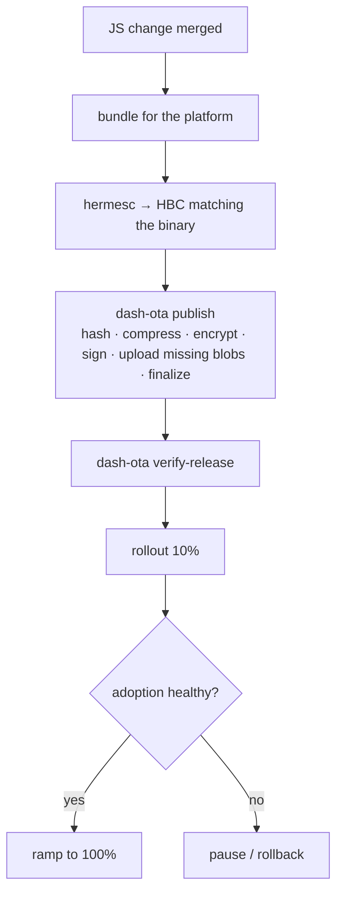

# dash-ota M2 — CLI (`@dash-ota/cli` 0.3.0) and docs Implementation Plan

> **For agentic workers:** REQUIRED SUB-SKILL: Use superpowers:subagent-driven-development (recommended) or superpowers:executing-plans to implement this plan task-by-task. Steps use checkbox (`- [ ]`) syntax for tracking.

**Goal:** Make `dash-ota publish` produce and upload protocol-v2 releases (per-file zstd blobs, three-step idempotent upload, `--app-id`, optional encryption), add `dash-ota verify-release` (reassemble a release exactly as a device would, from a throwaway enrolled device), update `list`, remove every trace of the SOA1 / `ciphertextB64` path, and rewrite the documentation site pages that describe the payload, endpoints, CLI, setup and security model for v2.

**Architecture:** The CLI stays a thin command layer over `@dash-ota/shared`: `buildReleaseV2` produces `{ manifest, blobs }`, the CLI signs the manifest and drives the backend's three admin endpoints (`POST /admin/releases` → `PUT …/blobs/{sha}` × missing → `POST …/finalize`), retrying only transient failures. `verify-release` simulates a device with a Node EC P-256 key (the same request signing the native module does), runs `/ota/v2/check`, fetches blobs through the device blob endpoint with the download token, and hands them to `verifyReleaseV2`. All logic that is worth a test lives in small modules (`upload.ts`, `publish.ts`, `list.ts`, `reuse.ts`, `device.ts`, `verify.ts`); `index.ts` only parses flags, prints, and dispatches — it executes `main()` on import, so nothing testable may live there.

**Tech Stack:** TypeScript 5.7 (strict, `noUncheckedIndexedAccess`, NodeNext), Node ≥ 20.19 (the engine floor of the `@mongodb-js/zstd` addon that `@dash-ota/shared` 0.3 depends on; `fetch`, `node:crypto`, `node:http`), esbuild single-file bundle, hand-rolled `check()` test runner run with `tsx --conditions source`, Docusaurus 3 docs with an autogenerated sidebar and `onBrokenLinks: 'throw'`.

**Spec:** `docs/superpowers/specs/2026-09-09-ota-v2-revamp-design.md` — this plan implements §5.1 (as the manifest the CLI emits and documents), §5.5 (client side), §7 (minus the M3 commands), §8 (CLI version) and §10 (the pages listed in *File structure* below).

## Global Constraints

- Package versions: `@dash-ota/cli` **0.3.0**; its devDependency `@dash-ota/shared` **^0.3.0**. All 0.x minor bumps are breaking (spec §8).
- Hard cut: after this plan the CLI has **no** `buildRelease`, `openRelease`, `ciphertextB64`, SOA1 or `/admin/publish` code path or doc mention (spec §5.5, decision in spec §1).
- `publish` requires `--app-id <applicationId|bundleIdentifier>`; the value goes into the signed manifest as `appId` (spec §5.1).
- Device endpoints are `/ota/v2/enroll`, `/ota/v2/check`, `/ota/v2/confirm`, `GET /ota/v2/releases/{bundleId}/blobs/{blobSha256}` with header `x-ota-download-token` (spec §5.4).
- Admin endpoints are `POST /admin/releases` → `{ bundleId, missing: [blobSha256…] }`, `PUT /admin/releases/{bundleId}/blobs/{blobSha256}` (raw `application/octet-stream`, `400` on hash/size mismatch, idempotent), `POST /admin/releases/{bundleId}/finalize` (spec §5.5); `GET /admin/releases` additionally returns `retiredClients` (spec §5.4).
- Retries: each blob `PUT` is attempted **3×** with exponential backoff (500 ms, 1 s); only network errors, `429` and `5xx` are retried — a `4xx` (hash mismatch) aborts immediately (spec §7).
- `--no-upload` writes `<bundle-dir>/../<bundleId>.v2/manifest.json` + `blobs/<blobSha256>` (the directive for this plan).
- `--patch-bases` and `--zstd` are **M3**; `parseArgs` already tolerates unknown flags, and `publish` refuses them with a clear message until 0.4.
- Compression happens inside `@dash-ota/shared` (`buildReleaseV2`); the CLI has no `zstd` binary prerequisite in M2.
- Code style: prettier `printWidth 130, singleQuote, trailingComma all, semi, arrowParens always`; eslint `typescript-eslint` recommended; JSDoc on every exported function; never print the admin token, a private key or a download token.
- Tests: extend `packages/cli/src/cli.test.ts` (hand-rolled `check(name, fn)` + `node:assert/strict`); run with `npm run test:cli`; the whole gate is `npm run ci` (typecheck + lint + format:check + all tests).
- Docs: every page keeps its frontmatter (`sidebar_position`, `title`); links are absolute `/docs/...`; `cd website && npm run build` must pass (broken links throw). Do not link to pages another plan creates (`concepts/delta-updates.md`, `architecture/slot-model.md` changes) — describe instead.
- Commits: Conventional Commits, **no `Co-authored-by` trailer**. The repo owner prefers one consolidated commit per delivered task; the per-task commits below are checkpoints and may be squashed before hand-off.

## Cross-plan contract (what this plan consumes; edit HERE if the other M2 plans drift)

From `@dash-ota/shared` 0.3 (the shared M2 plan) — **both build/verify functions are `async`** (the zstd binding `@mongodb-js/zstd` is async):

```ts
export interface ArchiveFile { path: string; data: Buffer }                 // unchanged: a plain file
export type Platform = 'ios' | 'android';
export type Channel = 'dev' | 'uat' | 'prod';
export interface BlobEntryV2 { sha256: string; size: number; compression: 'zstd' | 'none'; ivB64?: string; tagB64?: string }
export interface FileEntryV2 { path: string; role?: 'bundle'; sha256: string; size: number; blob: BlobEntryV2 }
export interface ManifestV2 {
  schema: 2; protocol: 2; bundleId: string; runtimeVersion: string; bundleVersion: number;
  platform: Platform; channel: Channel; appId: string; createdAt: string; mandatory: boolean;
  minNativeBuild?: number; targetAppVersions?: string; keyId: string; releaseNotes?: string;
  encryption: { mode: 'none' } | { mode: 'aes-256-gcm'; contentKeyB64: string };
  files: FileEntryV2[]; patches: unknown[];
}
export interface SignedManifest { manifest: ManifestV2; signatureB64: string; keyId: string }
export function signManifest(manifest: ManifestV2, privateKeyPem: string): SignedManifest;
export function verifyManifest(signed: SignedManifest, publicKey: string | KeyObject): boolean;
export interface BuildReleaseV2Input {
  bundleId: string; runtimeVersion: string; bundleVersion: number; platform: Platform; channel: Channel;
  appId: string; mandatory: boolean; files: ArchiveFile[]; keyId: string;
  encrypt: boolean; compressionLevel?: number; targetAppVersions?: string; releaseNotes?: string; minNativeBuild?: number;
}
export interface BuiltReleaseV2 { manifest: ManifestV2; blobs: Map<string, Buffer> }   // key = blob.sha256
export function buildReleaseV2(input: BuildReleaseV2Input): Promise<BuiltReleaseV2>;
export type BlobFetcher = (blobSha256: string) => Promise<Buffer>;
export interface VerifiedReleaseV2 { files: ArchiveFile[] }
export function verifyReleaseV2(signed: SignedManifest, fetchBlob: BlobFetcher, trustedPublicKey: string | KeyObject): Promise<VerifiedReleaseV2>;
// unchanged: generateSigningKeyPair, publicKeyFromRawB64, requestSigningString, verifyRequestEcdsa, sha256Hex, randomNonceB64, OTA_HEADERS
export interface CheckRequest { installId: string; platform: Platform; channel: Channel; runtimeVersion: string; appVersion: string; buildNumber: number; currentBundleVersion: number; protocol: 2; currentBundleId: string; currentBundleSha256: string }
export interface CheckResponse { update: SignedManifest | null; downloadToken?: string; serverNonce: string; nativePolicy: NativeVersionPolicy }
```

From `@dash-ota/backend` 0.3 (the backend M2 plan): the three publish endpoints and the device endpoints listed in *Global Constraints*, plus `GET /admin/releases` returning `{ releases: [{ bundleId, platform, channel, runtimeVersion, bundleVersion, rolloutPercentage, paused, rolledBack, mandatory, releaseNotes, adoption, createdAt, schema, finalized, blobCount, totalBytes }], retiredClients: { [channel]: { [platform]: number } } }` and `GET /admin/releases/{bundleId}` returning `{ release: <the same record> & { signedManifest } }` (used only by `verify-release --base`; if it is missing, `--base` fails with a clear 404 message and nothing else is affected).

## File structure

**Create**
- `packages/cli/src/upload.ts` — `uploadRelease` (three-step, retried) and `writeLocalArtifact` (`--no-upload`).
- `packages/cli/src/publish.ts` — `parsePublishFlags`, `summarizeSizes` (pure flag/summary logic for `publish`).
- `packages/cli/src/list.ts` — `formatReleaseLine`, `formatRetiredClients` and the `/admin/releases` response types.
- `packages/cli/src/reuse.ts` — `computeReuse(target, base)`: what a device holding `base` still downloads.
- `packages/cli/src/device.ts` — throwaway EC P-256 device: `createThrowawayDevice`, `signedPost`, `enrollDevice`, `checkForUpdate`, `fetchBlob`.
- `packages/cli/src/verify.ts` — `runVerifyRelease` (the `verify-release` orchestration, injectable server/token).
- `website/docs/architecture/blobs.md` — replaces `soa1-archive.md`.
- `website/docs/guides/migrate-to-v2.md` — order of operations for a consuming app.

**Modify**
- `packages/cli/src/util.ts` — `HttpError`, `withRetry`, `adminPutBytes`, `formatBytes`; `adminPost`/`adminGet` throw `HttpError`.
- `packages/cli/src/index.ts` — `cmdPublish` (v2), `cmdList`, new `cmdVerifyRelease`, `printHelp`.
- `packages/cli/src/cli.test.ts` — v1 fixtures → v2, new tests per task, a `startStub` helper.
- `packages/cli/package.json`, `packages/cli/README.md`.
- `website/docs/architecture/manifest-schema.md`, `website/docs/api/shared.md`.
- `website/docs/backend/endpoints.md`, `store.md`, `providers.md`, `express.md`; reference sweep in `backend/ops.md`, `backend/hardening.md`, `backend/configuration.md`, `backend/hooks.md`, `guides/self-host-backend.md`, `concepts/lifecycle.md`.
- `website/docs/cli/commands.md`, `release-workflow.md`, `overview.md`, `ci-cd.md`.
- `website/docs/react-native/android-setup.md`, `ios-setup.md`.
- `website/docs/security/threat-model.md`, `limitations.md`, `controls.md`.
- `website/docs/contributing/roadmap.md`.

**Delete**
- `website/docs/architecture/soa1-archive.md`.

**Ordering.** Tasks 1–7 (CLI) need `@dash-ota/shared` 0.3 in the workspace (`buildReleaseV2` / `verifyReleaseV2` exported) — they compile against the contract above. Tasks 8–13 (docs) have no code dependency and can run first or in parallel.

---

### Task 1: HTTP helpers, retry, byte formatting, version bump

**Files:**
- Modify: `packages/cli/src/util.ts`
- Modify: `packages/cli/package.json`
- Test: `packages/cli/src/cli.test.ts`

**Interfaces:**
- Consumes: nothing new.
- Produces: `class HttpError extends Error { status: number }`; `withRetry<T>(fn: (attempt: number) => Promise<T>, opts?: { attempts?: number; baseMs?: number; sleep?: Sleep; shouldRetry?: (err: unknown) => boolean; onRetry?: (attempt: number, err: unknown) => void }): Promise<T>`; `adminPutBytes(server: string, path: string, body: Buffer, adminToken: string): Promise<void>`; `formatBytes(n: number): string`; `type Sleep = (ms: number) => Promise<void>`; `adminPost`/`adminGet` now throw `HttpError` (message unchanged). Also the test helper `startStub(handler)` in `cli.test.ts`.

- [ ] **Step 1: Add the stub server helper and the failing tests to `cli.test.ts`**

Add these imports at the top of `packages/cli/src/cli.test.ts` (keep the existing ones):

```ts
import { createServer, type IncomingHttpHeaders } from 'node:http';
import { adminPutBytes, formatBytes, HttpError, withRetry } from './util.js';
```

Add the helper below `fakeProject(...)`:

```ts
interface StubReq {
  method: string;
  url: string;
  headers: IncomingHttpHeaders;
  body: Buffer;
}
interface StubRes {
  status: number;
  headers?: Record<string, string>;
  body?: Buffer | string;
}
type StubHandler = (req: StubReq) => StubRes;

/** A tiny node:http server for the CLI's network code. Every request is recorded for assertions. */
async function startStub(handler: StubHandler): Promise<{ base: string; requests: StubReq[]; close: () => void }> {
  const requests: StubReq[] = [];
  const server = createServer((req, res) => {
    const chunks: Buffer[] = [];
    req.on('data', (c: Buffer) => chunks.push(c));
    req.on('end', () => {
      const r: StubReq = { method: req.method ?? '', url: req.url ?? '', headers: req.headers, body: Buffer.concat(chunks) };
      requests.push(r);
      const out = handler(r);
      res.writeHead(out.status, { 'content-type': 'application/json', ...(out.headers ?? {}) });
      res.end(out.body ?? '{}');
    });
  });
  await new Promise<void>((resolve) => server.listen(0, '127.0.0.1', resolve));
  const addr = server.address();
  const port = typeof addr === 'object' && addr ? addr.port : 0;
  return { base: `http://127.0.0.1:${port}`, requests, close: () => server.close() };
}
```

Add these checks inside `main()` after the `resolveServer` check:

```ts
  await check('withRetry retries transient failures with exponential backoff and gives up after `attempts`', async () => {
    const delays: number[] = [];
    const fakeSleep = async (ms: number): Promise<void> => {
      delays.push(ms);
    };
    let calls = 0;
    const value = await withRetry(
      async () => {
        calls += 1;
        if (calls < 3) throw new Error('flaky');
        return 'ok';
      },
      { attempts: 3, baseMs: 100, sleep: fakeSleep },
    );
    assert.equal(value, 'ok');
    assert.deepEqual(delays, [100, 200]);
    await assert.rejects(
      () =>
        withRetry(
          async () => {
            throw new Error('always');
          },
          { attempts: 2, baseMs: 1, sleep: fakeSleep },
        ),
      /always/,
    );
  });

  await check('withRetry does NOT retry a 4xx HttpError (a hash mismatch is not transient) but does retry 503/429', async () => {
    const noSleep = async (): Promise<void> => {};
    let calls = 0;
    await assert.rejects(
      () =>
        withRetry(
          async () => {
            calls += 1;
            throw new HttpError(400, 'bad blob');
          },
          { attempts: 3, baseMs: 1, sleep: noSleep },
        ),
      /bad blob/,
    );
    assert.equal(calls, 1);
    let calls503 = 0;
    const v = await withRetry(
      async () => {
        calls503 += 1;
        if (calls503 === 1) throw new HttpError(503, 'busy');
        if (calls503 === 2) throw new HttpError(429, 'slow down');
        return 'done';
      },
      { attempts: 3, baseMs: 1, sleep: noSleep },
    );
    assert.equal(v, 'done');
    assert.equal(calls503, 3);
  });

  await check('adminPutBytes PUTs raw octet-stream bytes with the admin header and throws HttpError on non-2xx', async () => {
    const stub = await startStub((r) => (r.url.endsWith('/nope') ? { status: 400, body: '{"error":"hash mismatch"}' } : { status: 200 }));
    try {
      await adminPutBytes(stub.base, '/admin/releases/b1/blobs/abc', Buffer.from([1, 2, 3]), 'tok');
      const put = stub.requests[0];
      assert.ok(put);
      assert.equal(put.method, 'PUT');
      assert.equal(put.url, '/admin/releases/b1/blobs/abc');
      assert.equal(put.headers['content-type'], 'application/octet-stream');
      assert.equal(put.headers['x-ota-admin-token'], 'tok');
      assert.deepEqual([...put.body], [1, 2, 3]);
      await assert.rejects(
        () => adminPutBytes(stub.base, '/admin/releases/b1/blobs/nope', Buffer.alloc(1), 'tok'),
        (err: unknown) => err instanceof HttpError && err.status === 400 && /hash mismatch/.test(err.message),
      );
    } finally {
      stub.close();
    }
  });

  await check('formatBytes picks B / KB / MB with one decimal', () => {
    assert.equal(formatBytes(512), '512 B');
    assert.equal(formatBytes(2048), '2.0 KB');
    assert.equal(formatBytes(28_700_000), '27.4 MB');
  });
```

- [ ] **Step 2: Run the tests to verify they fail**

Run: `npm run test:cli`
Expected: FAIL — `SyntaxError: The requested module './util.js' does not provide an export named 'HttpError'` (or `withRetry`).

- [ ] **Step 3: Implement the helpers in `util.ts`**

Add after the `flagBool` function:

```ts
/** An HTTP failure from the admin / device API. `status` lets callers decide whether a retry makes sense. */
export class HttpError extends Error {
  constructor(
    public readonly status: number,
    message: string,
  ) {
    super(message);
    this.name = 'HttpError';
  }
}

/** Sleep, injectable so tests can run retries without waiting. */
export type Sleep = (ms: number) => Promise<void>;
const realSleep: Sleep = (ms) => new Promise((resolve) => setTimeout(resolve, ms));

/** Transient = a network-level failure, a 429, or a 5xx. A 4xx (bad hash, bad token) never succeeds on retry. */
export function isTransientError(err: unknown): boolean {
  if (err instanceof HttpError) return err.status === 429 || err.status >= 500;
  return true;
}

/**
 * Run `fn` up to `attempts` times, sleeping `baseMs × 2^(attempt-1)` between tries, and only when
 * {@link isTransientError} (or `opts.shouldRetry`) says the failure is worth retrying. Rethrows the last error.
 * @param fn the operation; receives the 1-based attempt number
 * @param opts attempts (default 3), baseMs (default 500), sleep (default real), shouldRetry, onRetry
 * @returns the first successful result
 * @throws the last error once attempts are exhausted or the error is not retryable
 */
export async function withRetry<T>(
  fn: (attempt: number) => Promise<T>,
  opts: {
    attempts?: number;
    baseMs?: number;
    sleep?: Sleep;
    shouldRetry?: (err: unknown) => boolean;
    onRetry?: (attempt: number, err: unknown) => void;
  } = {},
): Promise<T> {
  const attempts = opts.attempts ?? 3;
  const baseMs = opts.baseMs ?? 500;
  const sleep = opts.sleep ?? realSleep;
  const shouldRetry = opts.shouldRetry ?? isTransientError;
  let lastErr: unknown;
  for (let attempt = 1; attempt <= attempts; attempt++) {
    try {
      return await fn(attempt);
    } catch (err) {
      lastErr = err;
      if (attempt === attempts || !shouldRetry(err)) break;
      opts.onRetry?.(attempt, err);
      await sleep(baseMs * 2 ** (attempt - 1));
    }
  }
  throw lastErr instanceof Error ? lastErr : new Error(String(lastErr));
}

/** Human-readable byte count: `512 B`, `2.0 KB`, `27.4 MB`. */
export function formatBytes(n: number): string {
  if (n < 1024) return `${n} B`;
  if (n < 1024 * 1024) return `${(n / 1024).toFixed(1)} KB`;
  return `${(n / (1024 * 1024)).toFixed(1)} MB`;
}
```

Replace the bodies of `adminPost` and `adminGet` so they throw `HttpError`, and add `adminPutBytes`:

```ts
/** POST JSON to an admin endpoint; throws {@link HttpError} on non-2xx. */
export async function adminPost(server: string, path: string, body: unknown, adminToken: string): Promise<unknown> {
  const res = await fetch(`${server}${path}`, {
    method: 'POST',
    headers: { 'content-type': 'application/json', 'x-ota-admin-token': adminToken },
    body: JSON.stringify(body),
  });
  const text = await res.text();
  if (!res.ok) throw new HttpError(res.status, `POST ${path} → ${res.status}: ${text}`);
  return text ? JSON.parse(text) : {};
}

/** GET JSON from an admin endpoint; throws {@link HttpError} on non-2xx. */
export async function adminGet(server: string, path: string, adminToken: string): Promise<unknown> {
  const res = await fetch(`${server}${path}`, { headers: { 'x-ota-admin-token': adminToken } });
  const text = await res.text();
  if (!res.ok) throw new HttpError(res.status, `GET ${path} → ${res.status}: ${text}`);
  return text ? JSON.parse(text) : {};
}

/** PUT raw bytes (`application/octet-stream`) to an admin endpoint; throws {@link HttpError} on non-2xx. */
export async function adminPutBytes(server: string, path: string, body: Buffer, adminToken: string): Promise<void> {
  const res = await fetch(`${server}${path}`, {
    method: 'PUT',
    headers: { 'content-type': 'application/octet-stream', 'x-ota-admin-token': adminToken },
    body,
  });
  if (!res.ok) throw new HttpError(res.status, `PUT ${path} → ${res.status}: ${await res.text()}`);
}
```

- [ ] **Step 4: Bump the package and make the native zstd addon external**

In `packages/cli/package.json` set `"version": "0.3.0"`, `"@dash-ota/shared": "^0.3.0"` (still a devDependency — esbuild inlines it), and change the description to `"Release tooling for dash-ota: keygen, fingerprint, bundle, compress+sign, publish (per-file blobs), verify-release, and rollout ops. Holds the Ed25519 signing key (CI/release only). npx-executable."`.

Then three packaging changes forced by the zstd binding. `buildReleaseV2` pulls in `@mongodb-js/zstd`, a **prebuilt native addon**: `--packages=bundle` would try to inline a `.node` binary and produce a CLI that throws at run time, so it must be marked external and shipped as a real runtime dependency. Its engine floor (`>= 20.19.0`) also becomes the CLI's, which retires the `node18` target.

```jsonc
{
  "engines": { "node": ">=20.19.0" },
  "dependencies": {
    "@mongodb-js/zstd": "^7.0.0"
  },
  "scripts": {
    "build": "esbuild src/index.ts --bundle --platform=node --format=esm --target=node20 --packages=bundle --external:@mongodb-js/zstd --outfile=dist/index.mjs --banner:js=\"#!/usr/bin/env node\""
  }
}
```

Add `engines` and the `dependencies` block (the package has none today); replace only the `build` line in `scripts`. Everything else in the file stays as it is.

- [ ] **Step 5: Run the tests and the gate**

Run: `npm run test:cli && npm run typecheck && npm run lint && npm run format:check`
Expected: `… cli checks passed.` including the four new checks; typecheck/lint/format clean (run `npm run format` first if prettier complains).

- [ ] **Step 6: Commit**

```bash
git add packages/cli/src/util.ts packages/cli/src/cli.test.ts packages/cli/package.json
git commit -m "feat(cli): HttpError, withRetry, adminPutBytes and formatBytes for the v2 publish path (0.3.0)"
```

---

### Task 2: `upload.ts` — three-step idempotent upload and the `--no-upload` artifact

**Files:**
- Create: `packages/cli/src/upload.ts`
- Test: `packages/cli/src/cli.test.ts`

**Interfaces:**
- Consumes: `adminPost`, `adminPutBytes`, `withRetry`, `Sleep` (Task 1); `SignedManifest` (contract).
- Produces: `uploadRelease(server: string, adminToken: string, signed: SignedManifest, blobs: ReadonlyMap<string, Buffer>, opts: UploadReleaseOptions): Promise<UploadResult>` where `UploadReleaseOptions = { rolloutPercentage: number; onProgress?: (p: UploadProgress) => void; onRetry?: (blobSha256: string, attempt: number, err: unknown) => void; attempts?: number; sleep?: Sleep }`, `UploadProgress = { done: number; total: number; blobSha256: string; bytes: number }`, `UploadResult = { bundleId: string; uploaded: number; skipped: number; bytes: number }`; `writeLocalArtifact(dir: string, signed: SignedManifest, blobs: ReadonlyMap<string, Buffer>): { manifestPath: string; blobCount: number }`; `blobPath(bundleId: string, blobSha256: string): string`.

- [ ] **Step 1: Write the failing tests**

Add to the imports in `cli.test.ts`:

```ts
import { existsSync, readdirSync, readFileSync } from 'node:fs';
import { buildReleaseV2, generateSigningKeyPair, publicKeyFromRawB64, signManifest, verifyManifest } from '@dash-ota/shared';
import { blobPath, uploadRelease, writeLocalArtifact } from './upload.js';
```

(Replace the existing `import { buildRelease, generateSigningKeyPair, … } from '@dash-ota/shared';` line — `buildRelease` no longer exists.) Add a fixture builder below `startStub`:

```ts
/** A small two-file v2 release signed with a fresh key; the second file is a "png" so it stays uncompressed. */
async function fixtureRelease(bundleId: string, bundleVersion: number, bundleText = 'var x = 1;'.repeat(300)) {
  const kp = generateSigningKeyPair();
  const built = await buildReleaseV2({
    bundleId,
    runtimeVersion: 'R2',
    bundleVersion,
    platform: 'android',
    channel: 'dev',
    appId: 'com.example.app',
    mandatory: false,
    files: [
      { path: 'index.android.bundle', data: Buffer.from(bundleText, 'utf8') },
      { path: 'drawable-mdpi/logo.png', data: Buffer.from('PNG-BYTES-THAT-DO-NOT-CHANGE', 'utf8') },
    ],
    keyId: 'key_dev_1',
    encrypt: true,
  });
  const signed = signManifest(built.manifest, kp.privateKeyPem);
  return { kp, built, signed, publicKey: publicKeyFromRawB64(kp.publicKeyRawB64) };
}
```

Add the checks:

```ts
  await check('uploadRelease: POST manifest → PUT only the missing blobs (retrying a 503) → finalize', async () => {
    const { built, signed } = await fixtureRelease('bnd_up', 1);
    const shas = [...built.blobs.keys()];
    const missing = shas[0]!;
    const present = shas[1]!;
    let putCalls = 0;
    const stub = await startStub((r) => {
      if (r.method === 'POST' && r.url === '/admin/releases') {
        const body = JSON.parse(r.body.toString('utf8')) as { signedManifest: { manifest: { bundleId: string } }; rolloutPercentage: number };
        assert.equal(body.signedManifest.manifest.bundleId, 'bnd_up');
        assert.equal(body.rolloutPercentage, 25);
        return { status: 200, body: JSON.stringify({ bundleId: 'bnd_up', missing: [missing] }) };
      }
      if (r.method === 'PUT' && r.url === blobPath('bnd_up', missing)) {
        putCalls += 1;
        return putCalls === 1 ? { status: 503, body: '{"error":"busy"}' } : { status: 200 };
      }
      if (r.method === 'POST' && r.url === '/admin/releases/bnd_up/finalize') return { status: 200, body: '{"ok":true}' };
      return { status: 500, body: `{"error":"unexpected ${r.method} ${r.url}"}` };
    });
    try {
      const progress: number[] = [];
      const retries: number[] = [];
      const result = await uploadRelease(stub.base, 'tok', signed, built.blobs, {
        rolloutPercentage: 25,
        sleep: async () => {},
        onProgress: (p) => progress.push(p.done),
        onRetry: (_sha, attempt) => retries.push(attempt),
      });
      assert.deepEqual(result, { bundleId: 'bnd_up', uploaded: 1, skipped: 1, bytes: built.blobs.get(missing)!.length });
      assert.deepEqual(progress, [1]);
      assert.deepEqual(retries, [1]);
      assert.equal(putCalls, 2, 'the 503 is retried once');
      assert.ok(!stub.requests.some((r) => r.url === blobPath('bnd_up', present)), 'a blob the server has is never uploaded');
      assert.equal(stub.requests.at(-1)?.url, '/admin/releases/bnd_up/finalize', 'finalize is the last call');
      const put = stub.requests.find((r) => r.method === 'PUT' && r.url === blobPath('bnd_up', missing) && r.body.length > 0);
      assert.ok(put && put.body.equals(built.blobs.get(missing)!), 'the exact blob bytes are sent');
    } finally {
      stub.close();
    }
  });

  await check('uploadRelease: a 400 on PUT aborts without finalizing; an unknown hash in `missing` is a mismatch', async () => {
    const { built, signed } = await fixtureRelease('bnd_bad', 2);
    const sha = [...built.blobs.keys()][0]!;
    let finalized = false;
    const stub = await startStub((r) => {
      if (r.method === 'POST' && r.url === '/admin/releases') return { status: 200, body: JSON.stringify({ bundleId: 'bnd_bad', missing: [sha] }) };
      if (r.method === 'PUT') return { status: 400, body: '{"error":"hash mismatch"}' };
      finalized = true;
      return { status: 200 };
    });
    try {
      await assert.rejects(() => uploadRelease(stub.base, 'tok', signed, built.blobs, { rolloutPercentage: 100, sleep: async () => {} }), /hash mismatch/);
      assert.equal(finalized, false);
    } finally {
      stub.close();
    }
    const stub2 = await startStub(() => ({ status: 200, body: JSON.stringify({ bundleId: 'bnd_bad', missing: ['f'.repeat(64)] }) }));
    try {
      await assert.rejects(() => uploadRelease(stub2.base, 'tok', signed, built.blobs, { rolloutPercentage: 100 }), /mismatch/);
    } finally {
      stub2.close();
    }
  });

  await check('writeLocalArtifact writes manifest.json + blobs/<sha256> (the --no-upload layout)', async () => {
    const { built, signed } = await fixtureRelease('bnd_local', 3);
    const dir = join(mkdtempSync(join(tmpdir(), 'dash-ota-art-')), 'bnd_local.v2');
    const out = writeLocalArtifact(dir, signed, built.blobs);
    assert.equal(out.blobCount, built.blobs.size);
    assert.ok(existsSync(out.manifestPath));
    const parsed = JSON.parse(readFileSync(out.manifestPath, 'utf8')) as { signedManifest: typeof signed };
    assert.equal(parsed.signedManifest.manifest.bundleId, 'bnd_local');
    assert.deepEqual(readdirSync(join(dir, 'blobs')).sort(), [...built.blobs.keys()].sort());
    for (const [sha, data] of built.blobs) assert.ok(readFileSync(join(dir, 'blobs', sha)).equals(data));
  });
```

- [ ] **Step 2: Run the tests to verify they fail**

Run: `npm run test:cli`
Expected: FAIL — `Cannot find module './upload.js'`.

- [ ] **Step 3: Implement `upload.ts`**

```ts
/**
 * The three-step v2 publish: register the signed manifest (the backend answers with the blob
 * hashes it does not hold yet), PUT each missing blob as raw bytes, then finalize. Every step is
 * idempotent, so a failed publish is simply re-run and resumes where it stopped.
 *
 * @module upload
 */

import { mkdirSync, writeFileSync } from 'node:fs';
import { join } from 'node:path';
import type { SignedManifest } from '@dash-ota/shared';
import { adminPost, adminPutBytes, type Sleep, withRetry } from './util.js';

/** Progress after each blob that finished uploading. */
export interface UploadProgress {
  done: number;
  total: number;
  blobSha256: string;
  bytes: number;
}

export interface UploadReleaseOptions {
  rolloutPercentage: number;
  onProgress?: (p: UploadProgress) => void;
  onRetry?: (blobSha256: string, attempt: number, err: unknown) => void;
  /** PUT attempts per blob (default 3). */
  attempts?: number;
  sleep?: Sleep;
}

export interface UploadResult {
  bundleId: string;
  /** blobs the server asked for and received. */
  uploaded: number;
  /** blobs the server already held (a resumed publish). */
  skipped: number;
  /** bytes actually sent. */
  bytes: number;
}

interface CreateReleaseResponse {
  bundleId: string;
  missing: string[];
}

/** Admin path of one blob of a release. */
export function blobPath(bundleId: string, blobSha256: string): string {
  return `/admin/releases/${encodeURIComponent(bundleId)}/blobs/${blobSha256}`;
}

/**
 * Publish a v2 release: `POST /admin/releases` → `PUT` each blob in `missing` (retried, see
 * {@link withRetry}) → `POST …/finalize`.
 * @param server backend base URL
 * @param adminToken admin bearer (never logged)
 * @param signed the Ed25519-signed manifest
 * @param blobs every blob of the release keyed by `blob.sha256`
 * @returns what was uploaded vs already present
 * @throws HttpError from any step; a 4xx on a PUT aborts before finalize
 */
export async function uploadRelease(
  server: string,
  adminToken: string,
  signed: SignedManifest,
  blobs: ReadonlyMap<string, Buffer>,
  opts: UploadReleaseOptions,
): Promise<UploadResult> {
  const created = (await adminPost(
    server,
    '/admin/releases',
    { signedManifest: signed, rolloutPercentage: opts.rolloutPercentage },
    adminToken,
  )) as Partial<CreateReleaseResponse> | null;
  if (!created || typeof created.bundleId !== 'string' || !Array.isArray(created.missing)) {
    throw new Error('unexpected /admin/releases response — is the backend @dash-ota/backend >= 0.3?');
  }
  const { bundleId, missing } = created as CreateReleaseResponse;

  let bytes = 0;
  let done = 0;
  for (const sha of missing) {
    const data = blobs.get(sha);
    if (!data) throw new Error(`server asked for blob ${sha} which this build did not produce — manifest/blob mismatch`);
    await withRetry(() => adminPutBytes(server, blobPath(bundleId, sha), data, adminToken), {
      attempts: opts.attempts ?? 3,
      ...(opts.sleep ? { sleep: opts.sleep } : {}),
      onRetry: (attempt, err) => opts.onRetry?.(sha, attempt, err),
    });
    bytes += data.length;
    done += 1;
    opts.onProgress?.({ done, total: missing.length, blobSha256: sha, bytes: data.length });
  }

  await adminPost(server, `/admin/releases/${encodeURIComponent(bundleId)}/finalize`, {}, adminToken);
  return { bundleId, uploaded: missing.length, skipped: blobs.size - missing.length, bytes };
}

/**
 * `--no-upload`: write the signed manifest and every blob to `dir` (`manifest.json`, `blobs/<sha256>`)
 * so a release can be inspected or uploaded later.
 * @returns the manifest path and the number of blobs written
 */
export function writeLocalArtifact(
  dir: string,
  signed: SignedManifest,
  blobs: ReadonlyMap<string, Buffer>,
): { manifestPath: string; blobCount: number } {
  mkdirSync(join(dir, 'blobs'), { recursive: true });
  const manifestPath = join(dir, 'manifest.json');
  writeFileSync(manifestPath, JSON.stringify({ signedManifest: signed }, null, 2));
  for (const [sha, data] of blobs) writeFileSync(join(dir, 'blobs', sha), data);
  return { manifestPath, blobCount: blobs.size };
}
```

- [ ] **Step 4: Run the tests**

Run: `npm run test:cli`
Expected: PASS for the three new checks (the two pre-existing `buildRelease` checks now fail to import — Task 3 rewrites them; if you need a green run before Task 3, temporarily skip those two by commenting them out and restore them in Task 3).

- [ ] **Step 5: Commit**

```bash
git add packages/cli/src/upload.ts packages/cli/src/cli.test.ts
git commit -m "feat(cli): three-step idempotent blob upload and --no-upload artifact writer"
```

---

### Task 3: `publish` on the v2 pipeline (hard cut)

**Files:**
- Create: `packages/cli/src/publish.ts`
- Modify: `packages/cli/src/index.ts` (`cmdPublish`, imports, `printHelp`)
- Test: `packages/cli/src/cli.test.ts`

**Interfaces:**
- Consumes: `buildReleaseV2` (async), `signManifest`, `verifyManifest`, `ManifestV2` (contract); `uploadRelease`, `writeLocalArtifact` (Task 2); `formatBytes` (Task 1).
- Produces: `parsePublishFlags(args: ParsedArgs): PublishFlags` with `PublishFlags = { appId: string; encrypt: boolean; compressionLevel?: number }`; `summarizeSizes(manifest: ManifestV2): SizeSummary` with `SizeSummary = { files: number; blobs: number; plaintextBytes: number; blobBytes: number; ratio: number }`; `formatSizeSummary(s: SizeSummary): string`.

- [ ] **Step 1: Write the failing tests and migrate the two v1 fixtures**

In `cli.test.ts` replace the `key custody` check's `buildRelease({...})` block with:

```ts
    const { manifest } = await buildReleaseV2({
      bundleId: 'bnd_cli',
      runtimeVersion: 'R2',
      bundleVersion: 1,
      platform: 'android',
      channel: 'dev',
      appId: 'com.example.app',
      mandatory: false,
      files: [{ path: 'index.android.bundle', data: Buffer.from('x=1', 'utf8') }],
      keyId: 'key_dev_1',
      encrypt: true,
    });
```

and the same shape (with `bundleId: 'bnd_v'`) inside the `resolveVerifyKey` check. Add the import `import { formatSizeSummary, parsePublishFlags, summarizeSizes } from './publish.js';` and the checks:

```ts
  await check('parsePublishFlags: --app-id required, --no-encrypt, --compression-level 1..22, M3 flags refused', () => {
    assert.throws(() => parsePublishFlags(parseArgs(['publish'])), /--app-id/);
    const f = parsePublishFlags(parseArgs(['publish', '--app-id', 'com.example.app', '--no-encrypt', '--compression-level', '9']));
    assert.deepEqual(f, { appId: 'com.example.app', encrypt: false, compressionLevel: 9 });
    assert.deepEqual(parsePublishFlags(parseArgs(['publish', '--app-id', 'x'])), { appId: 'x', encrypt: true });
    assert.throws(() => parsePublishFlags(parseArgs(['publish', '--app-id', 'x', '--compression-level', '40'])), /1\.\.22/);
    assert.throws(() => parsePublishFlags(parseArgs(['publish', '--app-id', 'x', '--compression-level', 'fast'])), /1\.\.22/);
    assert.throws(() => parsePublishFlags(parseArgs(['publish', '--app-id', 'x', '--patch-bases', '3'])), /0\.4/);
    assert.throws(() => parsePublishFlags(parseArgs(['publish', '--app-id', 'x', '--zstd', '/usr/bin/zstd'])), /0\.4/);
  });

  await check('summarizeSizes counts files, unique blobs, plaintext vs blob bytes', async () => {
    const { built } = await fixtureRelease('bnd_sz', 4);
    const s = summarizeSizes(built.manifest);
    assert.equal(s.files, 2);
    assert.equal(s.blobs, built.blobs.size);
    assert.equal(s.plaintextBytes, built.manifest.files.reduce((n, f) => n + f.size, 0));
    assert.equal(s.blobBytes, [...built.blobs.values()].reduce((n, b) => n + b.length, 0));
    assert.ok(s.ratio > 0 && s.ratio < 1, `the repeated JS text must compress (ratio ${s.ratio})`);
    assert.match(formatSizeSummary(s), /2 files/);
  });
```

- [ ] **Step 2: Run the tests to verify they fail**

Run: `npm run test:cli`
Expected: FAIL — `Cannot find module './publish.js'`.

- [ ] **Step 3: Implement `publish.ts`**

```ts
/**
 * Pure pieces of `dash-ota publish`: flag validation and the size summary. Kept out of index.ts
 * (which runs main() on import) so they are unit-testable.
 *
 * @module publish
 */

import type { ManifestV2 } from '@dash-ota/shared';
import { flagBool, flagStr, formatBytes, type ParsedArgs } from './util.js';

export interface PublishFlags {
  /** Android applicationId / iOS bundle identifier the manifest is bound to. */
  appId: string;
  /** AES-256-GCM per blob (default) or compressed plaintext (`--no-encrypt`). */
  encrypt: boolean;
  /** zstd level 1..22; omitted = the shared defaults (19 for the bundle, 3 for the rest). */
  compressionLevel?: number;
}

/**
 * Validate the v2-specific publish flags.
 * @throws on a missing `--app-id`, an out-of-range `--compression-level`, or an M3-only flag
 */
export function parsePublishFlags(args: ParsedArgs): PublishFlags {
  if (args.flags['patch-bases'] !== undefined || args.flags['zstd'] !== undefined) {
    throw new Error('--patch-bases / --zstd arrive with bytecode deltas in @dash-ota/cli 0.4 — remove the flag for now');
  }
  const appId = flagStr(args, 'app-id');
  if (!appId) {
    throw new Error('--app-id <applicationId|bundleIdentifier> is required: the manifest is bound to the app it may run in');
  }
  const encrypt = !flagBool(args, 'no-encrypt');
  const levelRaw = flagStr(args, 'compression-level');
  if (!levelRaw) return { appId, encrypt };
  const compressionLevel = Number.parseInt(levelRaw, 10);
  if (!Number.isInteger(compressionLevel) || compressionLevel < 1 || compressionLevel > 22) {
    throw new Error(`--compression-level must be an integer 1..22 (got "${levelRaw}")`);
  }
  return { appId, encrypt, compressionLevel };
}

export interface SizeSummary {
  files: number;
  /** unique blobs (two identical files share one). */
  blobs: number;
  plaintextBytes: number;
  blobBytes: number;
  /** blobBytes / plaintextBytes (0 for an empty release). */
  ratio: number;
}

/** What the manifest says will cross the wire versus what lands on disk. */
export function summarizeSizes(manifest: ManifestV2): SizeSummary {
  const seen = new Map<string, number>();
  let plaintextBytes = 0;
  for (const f of manifest.files) {
    plaintextBytes += f.size;
    seen.set(f.blob.sha256, f.blob.size);
  }
  const blobBytes = [...seen.values()].reduce((n, b) => n + b, 0);
  return {
    files: manifest.files.length,
    blobs: seen.size,
    plaintextBytes,
    blobBytes,
    ratio: plaintextBytes === 0 ? 0 : blobBytes / plaintextBytes,
  };
}

/** One line for the publish summary. */
export function formatSizeSummary(s: SizeSummary): string {
  return `${s.files} files in ${s.blobs} blobs: ${formatBytes(s.plaintextBytes)} on disk → ${formatBytes(s.blobBytes)} on the wire (${Math.round(s.ratio * 100)}%)`;
}
```

- [ ] **Step 4: Rewrite `cmdPublish` in `index.ts`**

Change the `@dash-ota/shared` import to:

```ts
import { buildReleaseV2, type Channel, generateSigningKeyPair, type Platform, signManifest, verifyManifest } from '@dash-ota/shared';
```

add

```ts
import { formatSizeSummary, parsePublishFlags, summarizeSizes } from './publish.js';
import { uploadRelease, writeLocalArtifact } from './upload.js';
```

and add `formatBytes` to the `./util.js` import. Replace `cmdPublish` from `const bundleId = …` to the end of the function with:

```ts
  const appIdFlag = flagStr(args, 'app-id') || (interactive ? await ask('appId (applicationId / bundle identifier)') : '');
  const { appId, encrypt, compressionLevel } = parsePublishFlags({ ...args, flags: { ...args.flags, 'app-id': appIdFlag } });

  const bundleId = flagStr(args, 'bundle-id', `bnd_${runtimeVersion}_${bundleVersion}_${Date.now().toString(36)}`);

  console.log(`\n▸ hashing, compressing${encrypt ? ', encrypting' : ''} ${files.length} files…`);
  const built = await buildReleaseV2({
    bundleId,
    runtimeVersion,
    bundleVersion,
    platform,
    channel,
    appId,
    mandatory,
    files,
    keyId,
    encrypt,
    ...(compressionLevel !== undefined ? { compressionLevel } : {}),
    ...(targetAppVersions ? { targetAppVersions } : {}),
    ...(releaseNotes ? { releaseNotes } : {}),
  });
  const signed = signManifest(built.manifest, privateKeyPem);

  // Self-verify BEFORE upload against the public key the app embeds (or, failing that, a
  // consistency check against the signing key). Catches a wrong key / keyId mismatch that would
  // otherwise ship an update every device rejects.
  const verify = resolveVerifyKey(args, keyPath, privateKeyPem);
  if (!verifyManifest(signed, verify.key)) {
    throw new Error(
      `self-verify FAILED against ${verify.source}: the app embeds this key and would REJECT this update. Aborting.`,
    );
  }
  console.log(`  ✓ self-verified signature (${verify.source})`);

  const sizes = summarizeSizes(built.manifest);
  console.log(`\n  bundleId:        ${bundleId}   appId: ${appId}`);
  console.log(`  runtimeVersion:  ${runtimeVersion}   bundleVersion: ${bundleVersion}   rollout: ${rollout}%`);
  console.log(`  payload:         ${formatSizeSummary(sizes)}   encryption: ${encrypt ? 'aes-256-gcm' : 'none'}`);

  if (flagBool(args, 'no-upload')) {
    const outDir = join(bundleDir, '..', `${bundleId}.v2`);
    const { manifestPath, blobCount } = writeLocalArtifact(outDir, signed, built.blobs);
    console.log(`✓ wrote artifact (not uploaded): ${manifestPath} + ${blobCount} blobs`);
    return;
  }

  const { server, adminToken } = resolveServer(args);
  const result = await uploadRelease(server, adminToken, signed, built.blobs, {
    rolloutPercentage: rollout,
    onProgress: (p) =>
      process.stdout.write(`\r  ▸ uploaded ${p.done}/${p.total} blobs (${p.blobSha256.slice(0, 12)}…, ${formatBytes(p.bytes)})      `),
    onRetry: (sha, attempt, err) =>
      console.warn(`\n  ⚠ blob ${sha.slice(0, 12)}… attempt ${attempt} failed: ${err instanceof Error ? err.message : String(err)} — retrying`),
  });
  if (result.uploaded > 0) process.stdout.write('\n');
  console.log(
    `✓ published ${result.bundleId} to ${server}: ${result.uploaded} blobs uploaded (${formatBytes(result.bytes)}), ${result.skipped} already present, finalized at ${rollout}% rollout`,
  );
}
```

Update the `publish` block of `printHelp()` to:

```
  publish         --bundle-dir <dir> --platform --channel --app-id <id> --runtime-version auto|<R>
                  --bundle-version <n> [--mandatory] [--target-app-versions <range>]
                  [--rollout <pct>] [--release-note <txt>] [--no-encrypt] [--compression-level 1..22]
                  [--interactive] [--no-upload] [--key <pem>] [--key-id <id>] [--passphrase <p>]
                  [--verify-pub <rawB64>] [--server --admin-token]
                  (re-running a failed publish resumes: only blobs the server lacks are sent)
```

- [ ] **Step 5: Run the tests and the gate**

Run: `npm run test:cli && npm run typecheck && npm run lint && npm run format:check`
Expected: all cli checks pass; `grep -rn "buildRelease\b\|ciphertextB64\|openRelease\|/admin/publish" packages/cli/src` prints nothing.

- [ ] **Step 6: Commit**

```bash
git add packages/cli/src/publish.ts packages/cli/src/index.ts packages/cli/src/cli.test.ts
git commit -m "feat(cli)!: publish protocol-v2 releases (per-file blobs, --app-id, optional encryption); drop the SOA1 path"
```

---

### Task 4: `list` shows schema, finalized state, size and retired clients

**Files:**
- Create: `packages/cli/src/list.ts`
- Modify: `packages/cli/src/index.ts` (`cmdList`)
- Test: `packages/cli/src/cli.test.ts`

**Interfaces:**
- Consumes: `formatBytes` (Task 1); `GET /admin/releases` shape (contract).
- Produces: `ReleaseListEntry`, `ReleaseListResponse`, `formatReleaseLine(r: ReleaseListEntry): string`, `formatRetiredClients(rc: ReleaseListResponse['retiredClients']): string[]`.

- [ ] **Step 1: Write the failing test**

```ts
import { formatReleaseLine, formatRetiredClients } from './list.js';
```

```ts
  await check('list formatting: schema, finalized/paused/rolled-back state, size, retired clients', () => {
    const base = {
      bundleId: 'bnd_1',
      platform: 'android',
      channel: 'prod',
      runtimeVersion: '2',
      bundleVersion: 36,
      rolloutPercentage: 100,
      paused: false,
      rolledBack: false,
      adoption: { applied: 1, healthy: 2, failed: 0, rolled_back: 0 },
    };
    assert.equal(
      formatReleaseLine({ ...base, schema: 2, finalized: true, totalBytes: 12_000_000 }),
      'bnd_1  [android/prod]  rt=2 v36  schema=2  100%  11.4 MB  adoption={"applied":1,"healthy":2,"failed":0,"rolled_back":0}',
    );
    assert.match(formatReleaseLine({ ...base, schema: 2, finalized: false }), /UNFINALIZED/);
    assert.match(formatReleaseLine({ ...base, paused: true }), /PAUSED/);
    assert.match(formatReleaseLine({ ...base, rolledBack: true, paused: true }), /ROLLED_BACK/);
    assert.match(formatReleaseLine(base), /schema=1/);
    assert.deepEqual(formatRetiredClients(undefined), []);
    assert.deepEqual(formatRetiredClients({ prod: { android: 12, ios: 0 }, dev: { android: 0 } }), [
      '  retired v1 clients still checking: prod/android = 12',
    ]);
  });
```

- [ ] **Step 2: Run the test to verify it fails**

Run: `npm run test:cli`
Expected: FAIL — `Cannot find module './list.js'`.

- [ ] **Step 3: Implement `list.ts`**

```ts
/**
 * Formatting for `dash-ota list` (kept out of index.ts so it is testable).
 *
 * @module list
 */

import { formatBytes } from './util.js';

/** One row of `GET /admin/releases`. Fields after `adoption` exist from backend 0.3 on. */
export interface ReleaseListEntry {
  bundleId: string;
  platform: string;
  channel: string;
  runtimeVersion: string;
  bundleVersion: number;
  rolloutPercentage: number;
  paused: boolean;
  rolledBack: boolean;
  adoption: Record<string, number>;
  schema?: number;
  finalized?: boolean;
  blobCount?: number;
  totalBytes?: number;
  createdAt?: string;
}

export interface ReleaseListResponse {
  releases: ReleaseListEntry[];
  /** tombstone hits from protocol-v1 clients, per channel then platform. */
  retiredClients?: Record<string, Record<string, number>>;
}

/** `bundleId  [platform/channel]  rt=R vN  schema=S  <state>  <size>  adoption={…}` */
export function formatReleaseLine(r: ReleaseListEntry): string {
  const state = r.rolledBack ? 'ROLLED_BACK' : r.paused ? 'PAUSED' : r.finalized === false ? 'UNFINALIZED' : `${r.rolloutPercentage}%`;
  const size = typeof r.totalBytes === 'number' ? `  ${formatBytes(r.totalBytes)}` : '';
  return `${r.bundleId}  [${r.platform}/${r.channel}]  rt=${r.runtimeVersion} v${r.bundleVersion}  schema=${r.schema ?? 1}  ${state}${size}  adoption=${JSON.stringify(r.adoption)}`;
}

/** One line per channel/platform that still has v1 clients hitting the tombstone; empty when none. */
export function formatRetiredClients(rc: ReleaseListResponse['retiredClients']): string[] {
  if (!rc) return [];
  const lines: string[] = [];
  for (const [channel, byPlatform] of Object.entries(rc)) {
    for (const [platform, n] of Object.entries(byPlatform)) {
      if (n > 0) lines.push(`  retired v1 clients still checking: ${channel}/${platform} = ${n}`);
    }
  }
  return lines;
}
```

- [ ] **Step 4: Rewire `cmdList` in `index.ts`**

```ts
import { formatReleaseLine, formatRetiredClients, type ReleaseListResponse } from './list.js';
```

```ts
/** List releases + adoption, and any protocol-v1 clients still hitting the tombstone. */
async function cmdList(args: ParsedArgs): Promise<void> {
  const { server, adminToken } = resolveServer(args);
  const data = (await adminGet(server, '/admin/releases', adminToken)) as ReleaseListResponse;
  if (data.releases.length === 0) console.log('(no releases)');
  for (const r of data.releases) console.log(formatReleaseLine(r));
  for (const line of formatRetiredClients(data.retiredClients)) console.log(line);
}
```

- [ ] **Step 5: Run the tests and the gate**

Run: `npm run test:cli && npm run typecheck && npm run lint && npm run format:check`
Expected: PASS.

- [ ] **Step 6: Commit**

```bash
git add packages/cli/src/list.ts packages/cli/src/index.ts packages/cli/src/cli.test.ts
git commit -m "feat(cli): list shows schema, finalized state, payload size and retired v1 clients"
```

---

### Task 5: `reuse.ts` — what a device holding a base release still downloads

**Files:**
- Create: `packages/cli/src/reuse.ts`
- Test: `packages/cli/src/cli.test.ts`

**Interfaces:**
- Consumes: `ManifestV2`, `FileEntryV2` (contract).
- Produces: `computeReuse(target: ManifestV2, base: ManifestV2 | null): ReuseReport` with `ReuseReport = { reusable: FileEntryV2[]; download: FileEntryV2[]; bytesReusable: number; bytesDownload: number }` — byte counts are **blob** bytes over **unique** blobs (what crosses the wire).

- [ ] **Step 1: Write the failing test**

```ts
import { computeReuse } from './reuse.js';
```

```ts
  await check('computeReuse: files whose plaintext hash the base holds are reusable; bytes count unique blobs', async () => {
    const base = await fixtureRelease('bnd_base', 1, 'var x = 1;'.repeat(300));
    const next = await fixtureRelease('bnd_next', 2, 'var x = 2;'.repeat(300)); // bundle changes, logo.png is identical
    const r = computeReuse(next.built.manifest, base.built.manifest);
    assert.deepEqual(
      r.reusable.map((f) => f.path),
      ['drawable-mdpi/logo.png'],
    );
    assert.deepEqual(
      r.download.map((f) => f.path),
      ['index.android.bundle'],
    );
    const bundle = next.built.manifest.files.find((f) => f.role === 'bundle')!;
    assert.equal(r.bytesDownload, bundle.blob.size);
    assert.equal(r.bytesReusable, next.built.manifest.files.find((f) => f.path.endsWith('.png'))!.blob.size);
    const full = computeReuse(next.built.manifest, null);
    assert.equal(full.reusable.length, 0);
    assert.equal(full.bytesDownload, [...next.built.blobs.values()].reduce((n, b) => n + b.length, 0));
  });
```

- [ ] **Step 2: Run the test to verify it fails**

Run: `npm run test:cli`
Expected: FAIL — `Cannot find module './reuse.js'`.

- [ ] **Step 3: Implement `reuse.ts`**

```ts
/**
 * Reuse arithmetic for `verify-release --base`: a device already holding `base` reuses every file
 * whose plaintext sha256 it has and downloads the rest. Mirrors the device's want-list.
 *
 * @module reuse
 */

import type { FileEntryV2, ManifestV2 } from '@dash-ota/shared';

export interface ReuseReport {
  reusable: FileEntryV2[];
  download: FileEntryV2[];
  /** blob bytes (unique blobs) the device keeps from the base slot. */
  bytesReusable: number;
  /** blob bytes (unique blobs) the device fetches. */
  bytesDownload: number;
}

/** Sum `blob.size` over unique `blob.sha256` (two identical files are one download). */
function uniqueBlobBytes(entries: FileEntryV2[]): number {
  const seen = new Map<string, number>();
  for (const f of entries) seen.set(f.blob.sha256, f.blob.size);
  return [...seen.values()].reduce((n, b) => n + b, 0);
}

/**
 * Split `target.files` by whether `base` (null = nothing on device) holds the same plaintext hash.
 * @returns the two lists and their wire sizes
 */
export function computeReuse(target: ManifestV2, base: ManifestV2 | null): ReuseReport {
  const have = new Set((base?.files ?? []).map((f) => f.sha256));
  const reusable: FileEntryV2[] = [];
  const download: FileEntryV2[] = [];
  for (const f of target.files) (have.has(f.sha256) ? reusable : download).push(f);
  return { reusable, download, bytesReusable: uniqueBlobBytes(reusable), bytesDownload: uniqueBlobBytes(download) };
}
```

- [ ] **Step 4: Run the tests**

Run: `npm run test:cli`
Expected: PASS.

- [ ] **Step 5: Commit**

```bash
git add packages/cli/src/reuse.ts packages/cli/src/cli.test.ts
git commit -m "feat(cli): compute what a device holding a base release still downloads"
```

---

### Task 6: `device.ts` — a throwaway enrolled device for the CLI

**Files:**
- Create: `packages/cli/src/device.ts`
- Test: `packages/cli/src/cli.test.ts`

**Interfaces:**
- Consumes: `OTA_HEADERS`, `requestSigningString`, `sha256Hex`, `randomNonceB64`, `CheckRequest`, `CheckResponse`, `Platform`, `Channel` (contract); `HttpError` (Task 1).
- Produces: `ThrowawayDevice = { installId: string; privateKey: KeyObject; devicePublicKeyB64: string }`; `createThrowawayDevice(installId?: string): ThrowawayDevice`; `signRequest(device, method, path, body: Buffer, nonce, timestamp): string`; `signedPost<T>(server, path, body: unknown, device): Promise<T>`; `enrollDevice(server, device, o: EnrollOptions): Promise<void>` with `EnrollOptions = { platform: Platform; channel: Channel; appVersion: string; buildNumber: number; enrollToken?: string }`; `checkForUpdate(server, device, req: CheckRequest): Promise<CheckResponse>`; `fetchBlob(server, bundleId, blobSha256, downloadToken): Promise<Buffer>`.

- [ ] **Step 1: Write the failing tests (the stub verifies the real ECDSA signature)**

```ts
import { OTA_HEADERS, sha256Hex, verifyRequestEcdsa } from '@dash-ota/shared';
import { checkForUpdate, createThrowawayDevice, enrollDevice, fetchBlob, signedPost } from './device.js';
```

Add a helper below `startStub`:

```ts
/** Verify a stubbed request the way the backend does; returns false on any missing header or bad signature. */
function stubVerifySignature(r: StubReq, devicePublicKeyB64: string): boolean {
  const h = (name: string): string => {
    const v = r.headers[name];
    return typeof v === 'string' ? v : '';
  };
  const path = new URL(r.url, 'http://stub').pathname;
  return verifyRequestEcdsa(
    devicePublicKeyB64,
    { method: r.method, path, installId: h(OTA_HEADERS.installId), nonce: h(OTA_HEADERS.nonce), timestamp: h(OTA_HEADERS.timestamp), bodySha256: sha256Hex(r.body) },
    h(OTA_HEADERS.signature),
  );
}
```

Checks:

```ts
  await check('throwaway device: enroll sends the SPKI key; signed POSTs verify with verifyRequestEcdsa', async () => {
    const device = createThrowawayDevice();
    assert.match(device.installId, /^verify-[0-9a-f]{12}$/);
    const stub = await startStub((r) => {
      if (r.url === '/ota/v2/enroll') {
        const body = JSON.parse(r.body.toString('utf8')) as Record<string, unknown>;
        assert.equal(body['devicePublicKeyB64'], device.devicePublicKeyB64);
        assert.equal(body['enrollToken'], 'session-token');
        assert.equal(body['platform'], 'android');
        return { status: 200, body: '{"ok":true}' };
      }
      if (r.url === '/ota/v2/check') return stubVerifySignature(r, device.devicePublicKeyB64) ? { status: 200, body: '{"update":null,"serverNonce":"n","nativePolicy":{"minSupportedNativeVersion":0,"severity":"none"}}' } : { status: 401, body: '{"error":"bad signature"}' };
      return { status: 404 };
    });
    try {
      await enrollDevice(stub.base, device, { platform: 'android', channel: 'dev', appVersion: '1.0.0', buildNumber: 7, enrollToken: 'session-token' });
      const res = await checkForUpdate(stub.base, device, {
        installId: device.installId,
        platform: 'android',
        channel: 'dev',
        runtimeVersion: 'R2',
        appVersion: '1.0.0',
        buildNumber: 7,
        currentBundleVersion: 0,
        protocol: 2,
        currentBundleId: '',
        currentBundleSha256: '',
      });
      assert.equal(res.update, null);
      // a different device's key must not verify
      const other = createThrowawayDevice('verify-other');
      await assert.rejects(() => signedPost(stub.base, '/ota/v2/check', { installId: device.installId }, other), /401/);
    } finally {
      stub.close();
    }
  });

  await check('fetchBlob sends the download token and returns the bytes; 403 is an HttpError', async () => {
    const stub = await startStub((r) =>
      r.headers[OTA_HEADERS.downloadToken] === 'tok' && r.url === '/ota/v2/releases/bnd_x/blobs/abc'
        ? { status: 200, headers: { 'content-type': 'application/octet-stream' }, body: Buffer.from([9, 8, 7]) }
        : { status: 403, body: '{"error":"bad token"}' },
    );
    try {
      const data = await fetchBlob(stub.base, 'bnd_x', 'abc', 'tok');
      assert.deepEqual([...data], [9, 8, 7]);
      await assert.rejects(() => fetchBlob(stub.base, 'bnd_x', 'abc', 'wrong'), (err: unknown) => err instanceof HttpError && err.status === 403);
    } finally {
      stub.close();
    }
  });
```

- [ ] **Step 2: Run the tests to verify they fail**

Run: `npm run test:cli`
Expected: FAIL — `Cannot find module './device.js'`.

- [ ] **Step 3: Implement `device.ts`**

```ts
/**
 * A throwaway device for `verify-release`: a Node EC P-256 key standing in for the phone's
 * hardware key, and the same request signing the native module performs. Nothing here is
 * persisted — every run enrolls a fresh install id.
 *
 * @module device
 */

import { generateKeyPairSync, type KeyObject, randomBytes, sign as nodeSign } from 'node:crypto';
import {
  type Channel,
  type CheckRequest,
  type CheckResponse,
  OTA_HEADERS,
  type Platform,
  randomNonceB64,
  requestSigningString,
  sha256Hex,
} from '@dash-ota/shared';
import { HttpError } from './util.js';

export interface ThrowawayDevice {
  installId: string;
  privateKey: KeyObject;
  /** SPKI-DER base64 — what `/enroll` registers. */
  devicePublicKeyB64: string;
}

/** Generate a fresh P-256 keypair and install id (`verify-<12 hex>` unless given). */
export function createThrowawayDevice(installId?: string): ThrowawayDevice {
  const { privateKey, publicKey } = generateKeyPairSync('ec', { namedCurve: 'P-256' });
  return {
    installId: installId ?? `verify-${randomBytes(6).toString('hex')}`,
    privateKey,
    devicePublicKeyB64: publicKey.export({ type: 'spki', format: 'der' }).toString('base64'),
  };
}

/** ECDSA-P256-SHA256 over the canonical request string, DER → base64 (see `requestSigningString`). */
export function signRequest(device: ThrowawayDevice, method: string, path: string, body: Buffer, nonce: string, timestamp: string): string {
  const canonical = requestSigningString({ method, path, installId: device.installId, nonce, timestamp, bodySha256: sha256Hex(body) });
  return nodeSign('sha256', Buffer.from(canonical, 'utf8'), device.privateKey).toString('base64');
}

/**
 * POST JSON with the device-key signature headers; throws {@link HttpError} on non-2xx.
 * @returns the parsed JSON response
 */
export async function signedPost<T>(server: string, path: string, body: unknown, device: ThrowawayDevice): Promise<T> {
  const raw = Buffer.from(JSON.stringify(body), 'utf8');
  const nonce = randomNonceB64();
  const timestamp = String(Date.now());
  const res = await fetch(`${server}${path}`, {
    method: 'POST',
    headers: {
      'content-type': 'application/json',
      [OTA_HEADERS.installId]: device.installId,
      [OTA_HEADERS.nonce]: nonce,
      [OTA_HEADERS.timestamp]: timestamp,
      [OTA_HEADERS.signature]: signRequest(device, 'POST', path, raw, nonce, timestamp),
    },
    body: raw,
  });
  const text = await res.text();
  if (!res.ok) throw new HttpError(res.status, `POST ${path} → ${res.status}: ${text}`);
  return JSON.parse(text) as T;
}

export interface EnrollOptions {
  platform: Platform;
  channel: Channel;
  appVersion: string;
  buildNumber: number;
  /** the app-session token a production backend requires (`verifyEnrollToken`). */
  enrollToken?: string;
}

/** `POST /ota/v2/enroll` — unsigned (the device has no registered key yet). */
export async function enrollDevice(server: string, device: ThrowawayDevice, o: EnrollOptions): Promise<void> {
  const res = await fetch(`${server}/ota/v2/enroll`, {
    method: 'POST',
    headers: { 'content-type': 'application/json' },
    body: JSON.stringify({
      installId: device.installId,
      platform: o.platform,
      channel: o.channel,
      appVersion: o.appVersion,
      buildNumber: o.buildNumber,
      devicePublicKeyB64: device.devicePublicKeyB64,
      keyHardwareBacked: false,
      ...(o.enrollToken ? { enrollToken: o.enrollToken } : {}),
    }),
  });
  if (!res.ok) {
    throw new HttpError(
      res.status,
      `enroll → ${res.status}: ${await res.text()} (a production backend gates /enroll — pass --enroll-token or set OTA_ENROLL_TOKEN)`,
    );
  }
}

/** `POST /ota/v2/check` as the device. */
export function checkForUpdate(server: string, device: ThrowawayDevice, req: CheckRequest): Promise<CheckResponse> {
  return signedPost<CheckResponse>(server, '/ota/v2/check', req, device);
}

/** `GET /ota/v2/releases/{bundleId}/blobs/{blobSha256}` with the download token; whole blob in memory (CLI only). */
export async function fetchBlob(server: string, bundleId: string, blobSha256: string, downloadToken: string): Promise<Buffer> {
  const res = await fetch(`${server}/ota/v2/releases/${encodeURIComponent(bundleId)}/blobs/${blobSha256}`, {
    headers: { [OTA_HEADERS.downloadToken]: downloadToken },
  });
  if (!res.ok) throw new HttpError(res.status, `blob ${blobSha256.slice(0, 12)}… → ${res.status}: ${await res.text()}`);
  return Buffer.from(await res.arrayBuffer());
}
```

- [ ] **Step 4: Run the tests and the gate**

Run: `npm run test:cli && npm run typecheck && npm run lint && npm run format:check`
Expected: PASS.

- [ ] **Step 5: Commit**

```bash
git add packages/cli/src/device.ts packages/cli/src/cli.test.ts
git commit -m "feat(cli): throwaway enrolled device with native-equivalent request signing"
```

---

### Task 7: `verify-release` command, help, README, dist build

**Files:**
- Create: `packages/cli/src/verify.ts`
- Modify: `packages/cli/src/index.ts` (`cmdVerifyRelease`, dispatch, `printHelp`)
- Modify: `packages/cli/README.md`
- Test: `packages/cli/src/cli.test.ts`

**Interfaces:**
- Consumes: `verifyReleaseV2` (async), `publicKeyFromRawB64`, `SignedManifest`, `Platform`, `Channel` (contract); `adminGet`, `HttpError`, `formatBytes` (Task 1); `ReleaseListResponse` (Task 4); `computeReuse` (Task 5); everything in `device.ts` (Task 6).
- Produces: `runVerifyRelease(o: VerifyReleaseOptions): Promise<VerifyReleaseReport>` with `VerifyReleaseOptions = { server: string; adminToken: string; bundleId: string; base?: string; resolveTrustedKey: (keyId: string) => KeyObject; appVersion: string; buildNumber: number; enrollToken?: string; installId?: string; outDir: string; warn: (line: string) => void }` and `VerifyReleaseReport = { bundleId: string; files: number; plaintextBytes: number; blobsFetched: number; bytesFetched: number; outDir: string; base?: { bundleId: string; filesReusable: number; bytesReusable: number; filesDownload: number; bytesDownload: number } }`; `formatVerifyReport(r: VerifyReleaseReport): string[]`.

- [ ] **Step 1: Write the failing test (a stub backend serving a real v2 release)**

```ts
import { formatVerifyReport, runVerifyRelease } from './verify.js';
```

```ts
  await check('verify-release: enroll → check → fetch blobs → reassemble; reports reuse against --base; rejects a tampered blob', async () => {
    const base = await fixtureRelease('bnd_base2', 5, 'var y = 1;'.repeat(300));
    const target = await fixtureRelease('bnd_target', 6, 'var y = 2;'.repeat(300));
    let tamper = false;
    const listRow = (id: string, v: number) => ({
      bundleId: id,
      platform: 'android',
      channel: 'dev',
      runtimeVersion: 'R2',
      bundleVersion: v,
      rolloutPercentage: 100,
      paused: false,
      rolledBack: false,
      adoption: { applied: 0, healthy: 0, failed: 0, rolled_back: 0 },
      schema: 2,
      finalized: true,
    });
    const stub = await startStub((r) => {
      if (r.url === '/admin/releases') return { status: 200, body: JSON.stringify({ releases: [listRow('bnd_target', 6), listRow('bnd_base2', 5)], retiredClients: {} }) };
      if (r.url === '/admin/releases/bnd_base2') return { status: 200, body: JSON.stringify({ release: { ...listRow('bnd_base2', 5), signedManifest: base.signed } }) };
      if (r.url === '/ota/v2/enroll') return { status: 200, body: '{"ok":true}' };
      if (r.url === '/ota/v2/check') {
        const body = JSON.parse(r.body.toString('utf8')) as { currentBundleVersion: number; protocol: number };
        assert.equal(body.currentBundleVersion, 5);
        assert.equal(body.protocol, 2);
        return { status: 200, body: JSON.stringify({ update: target.signed, downloadToken: 'dl', serverNonce: 'n', nativePolicy: { minSupportedNativeVersion: 0, severity: 'none' } }) };
      }
      const m = /^\/ota\/v2\/releases\/bnd_target\/blobs\/([0-9a-f]{64})$/.exec(r.url);
      if (m && r.headers[OTA_HEADERS.downloadToken] === 'dl') {
        const data = Buffer.from(target.built.blobs.get(m[1]!)!);
        if (tamper) data[0] = data[0]! ^ 0xff;
        return { status: 200, headers: { 'content-type': 'application/octet-stream' }, body: data };
      }
      return { status: 404, body: '{"error":"not found"}' };
    });
    try {
      const outDir = mkdtempSync(join(tmpdir(), 'dash-ota-vr-'));
      const warnings: string[] = [];
      const report = await runVerifyRelease({
        server: stub.base,
        adminToken: 'tok',
        bundleId: 'bnd_target',
        base: 'bnd_base2',
        resolveTrustedKey: () => target.publicKey,
        appVersion: '1.0.0',
        buildNumber: 999,
        outDir,
        warn: (l) => warnings.push(l),
      });
      assert.equal(report.files, 2);
      assert.equal(report.blobsFetched, target.built.blobs.size);
      assert.equal(report.bytesFetched, [...target.built.blobs.values()].reduce((n, b) => n + b.length, 0));
      assert.equal(readFileSync(join(outDir, 'index.android.bundle'), 'utf8'), 'var y = 2;'.repeat(300));
      assert.equal(readFileSync(join(outDir, 'drawable-mdpi/logo.png'), 'utf8'), 'PNG-BYTES-THAT-DO-NOT-CHANGE');
      assert.deepEqual(report.base, {
        bundleId: 'bnd_base2',
        filesReusable: 1,
        bytesReusable: target.built.manifest.files.find((f) => f.path.endsWith('.png'))!.blob.size,
        filesDownload: 1,
        bytesDownload: target.built.manifest.files.find((f) => f.role === 'bundle')!.blob.size,
      });
      assert.deepEqual(warnings, []);
      assert.ok(formatVerifyReport(report).some((l) => /reusable/.test(l)));

      tamper = true;
      await assert.rejects(() =>
        runVerifyRelease({
          server: stub.base,
          adminToken: 'tok',
          bundleId: 'bnd_target',
          resolveTrustedKey: () => target.publicKey,
          appVersion: '1.0.0',
          buildNumber: 999,
          outDir: mkdtempSync(join(tmpdir(), 'dash-ota-vr2-')),
          warn: () => {},
        }),
      );
    } finally {
      stub.close();
    }
  });
```

- [ ] **Step 2: Run the test to verify it fails**

Run: `npm run test:cli`
Expected: FAIL — `Cannot find module './verify.js'`.

- [ ] **Step 3: Implement `verify.ts`**

```ts
/**
 * `dash-ota verify-release`: prove a published release is installable by doing exactly what a
 * device does — enroll a throwaway key, `/check`, fetch every blob through the device endpoint,
 * verify and reassemble with the shared reference implementation — and report the bytes a device
 * already holding `--base` would still download.
 *
 * @module verify
 */

import type { KeyObject } from 'node:crypto';
import { mkdirSync, writeFileSync } from 'node:fs';
import { dirname, join } from 'node:path';
import { type Channel, type Platform, type SignedManifest, verifyReleaseV2 } from '@dash-ota/shared';
import { checkForUpdate, createThrowawayDevice, enrollDevice, fetchBlob } from './device.js';
import type { ReleaseListEntry, ReleaseListResponse } from './list.js';
import { computeReuse } from './reuse.js';
import { adminGet, formatBytes } from './util.js';

export interface VerifyReleaseOptions {
  server: string;
  adminToken: string;
  bundleId: string;
  /** an earlier release to compute reuse against (needs `GET /admin/releases/{bundleId}`). */
  base?: string;
  /** the public key the app embeds for the manifest's `keyId`. */
  resolveTrustedKey: (keyId: string) => KeyObject;
  appVersion: string;
  buildNumber: number;
  enrollToken?: string;
  installId?: string;
  /** where the reassembled files are written. */
  outDir: string;
  warn: (line: string) => void;
}

export interface VerifyReleaseReport {
  bundleId: string;
  files: number;
  plaintextBytes: number;
  blobsFetched: number;
  bytesFetched: number;
  outDir: string;
  base?: { bundleId: string; filesReusable: number; bytesReusable: number; filesDownload: number; bytesDownload: number };
}

function asPlatform(v: string): Platform {
  if (v !== 'ios' && v !== 'android') throw new Error(`release has an unexpected platform "${v}"`);
  return v;
}
function asChannel(v: string): Channel {
  if (v !== 'dev' && v !== 'uat' && v !== 'prod') throw new Error(`release has an unexpected channel "${v}"`);
  return v;
}

/**
 * Run the device flow for one release.
 * @throws when the release is unknown / not finalized / paused / rolled back, when the server offers
 *   a different bundle, or when any blob or file fails verification (via `verifyReleaseV2`)
 */
export async function runVerifyRelease(o: VerifyReleaseOptions): Promise<VerifyReleaseReport> {
  const list = (await adminGet(o.server, '/admin/releases', o.adminToken)) as ReleaseListResponse;
  const target: ReleaseListEntry | undefined = list.releases.find((r) => r.bundleId === o.bundleId);
  if (!target) throw new Error(`release ${o.bundleId} not found on ${o.server}`);
  if (target.finalized === false) throw new Error(`release ${o.bundleId} is not finalized — re-run publish to upload the missing blobs`);
  if (target.rolledBack) throw new Error(`release ${o.bundleId} is rolled back`);
  if (target.paused) throw new Error(`release ${o.bundleId} is paused — devices are not offered it`);
  if (target.rolloutPercentage < 100) {
    o.warn(`rollout is ${target.rolloutPercentage}% — the throwaway install may fall outside the bucket; pass --install-id to re-roll`);
  }

  const platform = asPlatform(target.platform);
  const channel = asChannel(target.channel);
  const device = createThrowawayDevice(o.installId);
  await enrollDevice(o.server, device, {
    platform,
    channel,
    appVersion: o.appVersion,
    buildNumber: o.buildNumber,
    ...(o.enrollToken ? { enrollToken: o.enrollToken } : {}),
  });
  const check = await checkForUpdate(o.server, device, {
    installId: device.installId,
    platform,
    channel,
    runtimeVersion: target.runtimeVersion,
    appVersion: o.appVersion,
    buildNumber: o.buildNumber,
    currentBundleVersion: target.bundleVersion - 1,
    protocol: 2,
    currentBundleId: '',
    currentBundleSha256: '',
  });
  const offered = check.update?.manifest.bundleId;
  if (!check.update || offered !== o.bundleId) {
    throw new Error(
      `server offered ${offered ?? 'no update'} instead of ${o.bundleId} — check rollout %, pause state, targetAppVersions (--app-version) and minNativeBuild (--build-number)`,
    );
  }
  if (!check.downloadToken) throw new Error('check returned an update but no downloadToken');
  const token = check.downloadToken;
  const signed: SignedManifest = check.update;

  let blobsFetched = 0;
  let bytesFetched = 0;
  const verified = await verifyReleaseV2(
    signed,
    async (blobSha256) => {
      const data = await fetchBlob(o.server, o.bundleId, blobSha256, token);
      blobsFetched += 1;
      bytesFetched += data.length;
      return data;
    },
    o.resolveTrustedKey(signed.keyId),
  );

  let plaintextBytes = 0;
  for (const f of verified.files) {
    const dest = join(o.outDir, f.path); // paths were validated by verifyReleaseV2
    mkdirSync(dirname(dest), { recursive: true });
    writeFileSync(dest, f.data);
    plaintextBytes += f.data.length;
  }

  const report: VerifyReleaseReport = { bundleId: o.bundleId, files: verified.files.length, plaintextBytes, blobsFetched, bytesFetched, outDir: o.outDir };
  if (o.base) {
    const rec = (await adminGet(o.server, `/admin/releases/${encodeURIComponent(o.base)}`, o.adminToken)) as { release: { signedManifest: SignedManifest } };
    const reuse = computeReuse(signed.manifest, rec.release.signedManifest.manifest);
    report.base = {
      bundleId: o.base,
      filesReusable: reuse.reusable.length,
      bytesReusable: reuse.bytesReusable,
      filesDownload: reuse.download.length,
      bytesDownload: reuse.bytesDownload,
    };
  }
  return report;
}

/** Lines for the terminal. */
export function formatVerifyReport(r: VerifyReleaseReport): string[] {
  const lines = [
    `✓ ${r.bundleId}: ${r.files} files (${formatBytes(r.plaintextBytes)}) reassembled and verified in ${r.outDir}`,
    `  downloaded as a fresh device: ${r.blobsFetched} blobs, ${formatBytes(r.bytesFetched)}`,
  ];
  if (r.base) {
    lines.push(
      `  vs base ${r.base.bundleId}: ${r.base.filesReusable} files reusable (${formatBytes(r.base.bytesReusable)}), a device on it downloads ${r.base.filesDownload} files (${formatBytes(r.base.bytesDownload)})`,
    );
  }
  return lines;
}
```

- [ ] **Step 4: Wire `cmdVerifyRelease` in `index.ts`**

Imports to add: `import { mkdtempSync } from 'node:fs';` (merge into the existing `node:fs` import), `import { tmpdir } from 'node:os';`, `import type { KeyObject } from 'node:crypto';`, `publicKeyFromRawB64` into the `@dash-ota/shared` import, and `import { formatVerifyReport, runVerifyRelease } from './verify.js';`. Add the command:

```ts
/** Reassemble a published release the way a device would and report what it would download. */
async function cmdVerifyRelease(args: ParsedArgs): Promise<void> {
  const bundleId = flagStr(args, 'bundle-id');
  if (!bundleId) throw new Error('--bundle-id is required');
  const { server, adminToken } = resolveServer(args);
  const resolveTrustedKey = (keyId: string): KeyObject => {
    const pub = flagStr(args, 'pub');
    if (pub) return publicKeyFromRawB64(pub);
    const keyFile = flagStr(args, 'key-file') || join('.keys', `${keyId}.public.json`);
    if (!existsSync(keyFile)) {
      throw new Error(`no public key for keyId "${keyId}": pass --pub <rawB64> or --key-file <.public.json> (looked for ${keyFile})`);
    }
    return publicKeyFromRawB64((JSON.parse(readFileSync(keyFile, 'utf8')) as { publicKeyRawB64: string }).publicKeyRawB64);
  };
  const buildNumber = Number.parseInt(flagStr(args, 'build-number', '999999999'), 10);
  if (!Number.isInteger(buildNumber)) throw new Error('--build-number must be an integer');
  const base = flagStr(args, 'base');
  const enrollToken = flagStr(args, 'enroll-token') || process.env.OTA_ENROLL_TOKEN || '';
  const installId = flagStr(args, 'install-id');
  const report = await runVerifyRelease({
    server,
    adminToken,
    bundleId,
    ...(base ? { base } : {}),
    resolveTrustedKey,
    appVersion: flagStr(args, 'app-version', '0.0.0'),
    buildNumber,
    ...(enrollToken ? { enrollToken } : {}),
    ...(installId ? { installId } : {}),
    outDir: flagStr(args, 'out') || mkdtempSync(join(tmpdir(), 'dash-ota-verify-')),
    warn: (line) => console.warn(`  ⚠ ${line}`),
  });
  for (const line of formatVerifyReport(report)) console.log(line);
}
```

Add `case 'verify-release': return cmdVerifyRelease(args);` to `main()` and this block to `printHelp()` after `list`:

```
  verify-release  --bundle-id <id> [--base <bundleId>] [--pub <rawB64> | --key-file <.public.json>]
                  [--app-version <v>] [--build-number <n>] [--enroll-token <t> | OTA_ENROLL_TOKEN]
                  [--install-id <id>] [--out <dir>] [--server --admin-token]
                  (enrolls a throwaway device, runs /check, downloads and verifies every blob —
                   exit 1 on any mismatch; --base prints what a device on that release still downloads)
```

Also update the header comment of `index.ts`: replace `publish          encrypt + SIGN + upload a release (interactive release notes)` with `publish          hash + compress + (encrypt) + SIGN + upload per-file blobs` and add `verify-release   reassemble a release as a device would (CI gate)` after `list`.

- [ ] **Step 5: Update `packages/cli/README.md`**

Replace the `### Release lifecycle` block's step 2–3 and the `Commands:` line with:

````md
# 2. bundle the JS (compile to Hermes HBC for Hermes builds) then publish a signed release
npx dash-ota publish \
  --bundle-dir ./out --platform android --channel prod --app-id com.example.app \
  --runtime-version auto --bundle-version 7 \
  --rollout 10 --release-note "Fix order confirmation crash"
# every file is hashed, zstd-compressed and (by default) AES-256-GCM encrypted into its own blob;
# only blobs the server does not already hold are uploaded, so a failed publish is simply re-run

# 3. prove a device can install it (CI gate)
npx dash-ota verify-release --bundle-id <id> --key-file .keys/key_prod_1.public.json --base <previous id>

# 4. operate
npx dash-ota list
npx dash-ota rollout  --bundle-id <id> --pct 50
npx dash-ota pause    --bundle-id <id>     # --resume to resume
npx dash-ota rollback --bundle-id <id>
npx dash-ota native-policy --channel prod --min 42 --severity hard --store-url <url>
```

Commands: `keygen` · `register-key` · `fingerprint` (computes the native-compat `runtimeVersion`)
· `bundle` · `publish` · `verify-release` · `list` · `rollout` · `pause` · `rollback` · `native-policy`.
````

Change the first paragraph's "it bundles, encrypts, **signs**, and publishes updates" to "it bundles, compresses, optionally encrypts, **signs**, and publishes updates as per-file blobs".

- [ ] **Step 6: Run everything and build the executable**

Run: `npm run test:cli && npm run ci && npm -w @dash-ota/cli run build && node packages/cli/dist/index.mjs help | grep -c 'verify-release'`
Expected: tests pass, `ci` green, the last command prints `1`.

- [ ] **Step 7: Commit**

```bash
git add packages/cli/src/verify.ts packages/cli/src/index.ts packages/cli/src/cli.test.ts packages/cli/README.md
git commit -m "feat(cli): verify-release reassembles a release as a device would; help and README for 0.3"
```

---

### Task 8: Docs — architecture: manifest schema v2, blobs page, delete SOA1, fix links

**Files:**
- Modify: `website/docs/architecture/manifest-schema.md` (full replacement)
- Create: `website/docs/architecture/blobs.md`
- Delete: `website/docs/architecture/soa1-archive.md`
- Modify: `website/docs/api/shared.md` (the *Release & archive* section)

- [ ] **Step 1: Confirm the only links to the SOA1 page**

Run: `grep -rn 'soa1-archive' website/docs website/src`
Expected: exactly `website/docs/architecture/manifest-schema.md` and `website/docs/api/shared.md` (both rewritten below). If anything else appears, fix that link to `/docs/architecture/blobs` in the same commit.

- [ ] **Step 2: Replace `website/docs/architecture/manifest-schema.md` with**

````md
---
sidebar_position: 1
title: Manifest schema
---

# Manifest schema (v2)

The manifest is the signed source of truth for a release. The Ed25519 signature covers the whole
`manifest` object, so nothing in it — not a file hash, not the app id, not the encryption key —
can be altered after signing.

```jsonc
{
  "manifest": {
    "schema": 2,
    "protocol": 2,
    "bundleId": "bnd_2_36_mtt9k2a1",
    "runtimeVersion": "2",              // must match the binary's
    "bundleVersion": 36,                // monotonic; downgrade guard
    "platform": "android",              // ios | android
    "channel": "prod",                  // dev | uat | prod
    "appId": "com.example.app",         // applicationId / bundle identifier; verified natively
    "createdAt": "2026-09-09T06:12:00.000Z",
    "mandatory": false,
    "minNativeBuild": 6,                // optional
    "targetAppVersions": ">=1.0.6",     // optional semver range
    "keyId": "key_prod_1",
    "releaseNotes": "Fix order confirmation crash",
    "encryption": { "mode": "aes-256-gcm", "contentKeyB64": "..." },   // or { "mode": "none" }
    "files": [
      {
        "path": "index.android.bundle", "role": "bundle",
        "sha256": "…plaintext hash…", "size": 27014982,
        "blob": { "sha256": "…stored-bytes hash…", "size": 7629311, "compression": "zstd", "ivB64": "…", "tagB64": "…" }
      },
      {
        "path": "drawable-xxhdpi/src_assets_images_logo.png",
        "sha256": "…", "size": 12345,
        "blob": { "sha256": "…", "size": 12373, "compression": "none", "ivB64": "…", "tagB64": "…" }
      }
    ],
    "patches": []                        // reserved for bytecode deltas; always [] from a 0.3 CLI
  },
  "signatureB64": "...",                 // Ed25519 over canonicalize(manifest)
  "keyId": "key_prod_1"                  // which trusted key signed it
}
```

## Fields

| Field | Meaning |
|---|---|
| `schema` / `protocol` | both `2`. A client refuses any other value. |
| `appId` | the Android `applicationId` / iOS bundle identifier. Native compares it with the running app's own id, so a validly signed bundle for a *different* app is rejected even when both apps trust the same key. |
| `files[].sha256`, `size` | the **plaintext** file that lands on disk. |
| `files[].role` | exactly one entry is `"bundle"` — the Hermes bytecode; its `path` is the platform entry file (`index.android.bundle` / `main.jsbundle`). |
| `files[].blob` | the **stored bytes** for that file: `blob.sha256` is the hash of exactly what `GET /ota/v2/releases/{bundleId}/blobs/{blob.sha256}` returns — after compression and, if enabled, encryption. |
| `blob.compression` | `zstd` or `none`. Already-dense files (`png jpg jpeg webp gif mp4 m4a mp3 zip gz zst woff woff2`) and anything that would not shrink below 98 % are stored as `none`. |
| `blob.ivB64`, `blob.tagB64` | present only when `encryption.mode` is `aes-256-gcm`: a random 12-byte IV per blob and the GCM tag. The additional authenticated data is `bundleId + "/" + files[].sha256`, so a blob cannot be moved between releases or paths. |
| `encryption` | one random 32-byte content key per release (`aes-256-gcm`), or `{ "mode": "none" }` when published with `--no-encrypt`. |
| `patches` | reserved for bytecode deltas (a later release); empty in 0.3. |

### Path rules

Every `files[].path` is validated at sign time, at publish time, and again on the device: relative,
POSIX separators, no empty segment, no `.` or `..` segment, no leading `/`, no NUL byte, at most 512
bytes. A manifest that breaks one rule is rejected everywhere.

## How native uses it

1. Recompute the **canonical bytes** of `manifest` and verify `signatureB64` against the embedded
   public key for `keyId`.
2. Check `schema == 2`, `appId` == the running app, `runtimeVersion` == the binary's, and
   `bundleVersion` > current.
3. Work out which `files[].sha256` it already holds (the current slot, last-known-good, and on iOS
   the app bundle) and download **only the other blobs** — see [Blobs](/docs/architecture/blobs).
4. For each downloaded blob: verify `blob.sha256` and `blob.size`, decrypt (the GCM tag
   authenticates the bytes), decompress, then verify the plaintext `sha256` and `size`.
5. Hard-link or copy reused files into the new slot and re-hash them — being on disk already is
   never a trust state.

## Why per-file hashes

A single-blob hash would let an attacker swap one asset within an otherwise-valid payload. The
signed per-file list closes that — native rejects the whole release if any file mismatches. In v2
the same list is also what makes **partial downloads** safe: reuse is decided by hash, and every
reused file is re-verified.

→ [Blobs](/docs/architecture/blobs) · [Request signing](/docs/architecture/request-signing)
````

- [ ] **Step 3: Create `website/docs/architecture/blobs.md`**

````md
---
sidebar_position: 2
title: Blobs
---

# Blobs — per-file, content-addressed payloads

A release is not one archive. Every file in the manifest is stored and fetched as its own **blob**,
addressed by the hash of its stored bytes:

```
releases/{bundleId}/{blob.sha256}
```

The blob is the file after compression (zstd, unless the file is already dense) and, when the
release is encrypted, after AES-256-GCM. `blob.sha256` in the manifest is the hash of exactly those
bytes, so a device — or a CDN — can check a blob without decrypting it.

## Why per-file

| | one archive (≤ 0.2) | per-file blobs (0.3) |
|---|---|---|
| Unchanged assets between releases | re-sent every time | never sent — the device already holds the hash |
| Memory on device | whole ciphertext in RAM (iOS) | one blob at a time, streamed to disk |
| Resume after a dropped connection | restart the whole download | continue the interrupted blob (`Range`) |
| Adding / removing / renaming assets | works | works — the manifest is the only file list |
| Compression | none | zstd (a 27 MB Hermes bundle → about 7.6 MB) |

## Lifecycle

1. **CLI (`dash-ota publish`)** — read the bundle dir → hash each file → compress → encrypt → build
   the manifest → sign → `POST /admin/releases` (the server answers with the blob hashes it does
   not hold yet) → `PUT` each missing blob → `POST …/finalize`. Every step is idempotent, so a
   failed publish is simply re-run.
2. **Device** — `/check` returns the signed manifest. The device hashes what it already has (the
   current slot, last-known-good, on iOS the app bundle), downloads only the missing blobs in a
   small pool, verifies each one (`blob.sha256` → GCM tag → plaintext `sha256`), hard-links the
   rest from the current slot with a re-hash, and commits the new slot atomically.

## Server-side layout

Blobs live in the `BlobStore` under `releases/{bundleId}/…`; the manifest and rollout state live in
the `DatabaseProvider`. A release is only offered to devices once it is **finalized**, i.e. every
blob the manifest lists is present with the right size. Rolling a release back makes its blobs
answer `410`.

Keys are namespaced per release on purpose: retention and authorization stay trivial (delete the
prefix, scope the download token to one `bundleId`), and the download URL is immutable, so a CDN can
cache it. Cross-release deduplication on the server is deliberately **not** a goal — storage is
cheap; bandwidth to a phone is not, and that is solved on the device.

## Encryption is optional

`dash-ota publish --no-encrypt` stores compressed plaintext; the blob hash and the signed manifest
still authenticate every byte. Encryption stays the default because the content key rides inside the
signed manifest anyway — see the [threat model](/docs/security/threat-model).

→ [Manifest schema](/docs/architecture/manifest-schema) · [Slot model](/docs/architecture/slot-model)
````

- [ ] **Step 4: Delete the SOA1 page and update `api/shared.md`**

Run: `git rm website/docs/architecture/soa1-archive.md`

In `website/docs/api/shared.md` replace the `## Release & archive` section with:

```md
## Release & blobs
- `buildReleaseV2({...})` — hash + zstd-compress + optionally encrypt every file and build the v2
  manifest; resolves to `{ manifest, blobs }` (`Map<blobSha256, Buffer>`).
- `verifyReleaseV2(signedManifest, fetchBlob, publicKey)` — verify the signature, fetch each blob
  through the callback, verify blob hash → GCM tag → plaintext hash, and resolve to the files (the
  reference the native side mirrors; `dash-ota verify-release` runs it).
- `validateManifestShape(value)` — schema-2 shape and path rules. → [Blobs](/docs/architecture/blobs)
```

- [ ] **Step 5: Build the site**

Run: `cd website && npm run build`
Expected: `[SUCCESS] Generated static files in "build".` with no broken-link error.

- [ ] **Step 6: Commit**

```bash
git add website/docs/architecture/manifest-schema.md website/docs/architecture/blobs.md website/docs/api/shared.md
git commit -m "docs(architecture): manifest schema v2 and per-file blobs; retire the SOA1 page"
```

---

### Task 9: Docs — backend endpoints, store, providers, Express; sweep stale v1 references

**Files:**
- Modify: `website/docs/backend/endpoints.md` (full replacement), `store.md`, `providers.md`, `express.md`
- Modify (one-line sweeps): `website/docs/backend/ops.md`, `backend/hardening.md`, `backend/configuration.md`, `backend/hooks.md`, `guides/self-host-backend.md`, `concepts/lifecycle.md`

- [ ] **Step 1: Replace `website/docs/backend/endpoints.md` with**

````md
---
sidebar_position: 8
title: Endpoints & request signing
---

# Endpoints & request signing

All client endpoints except `/enroll` are authenticated with the device-key signature; blob
downloads use the download token issued by `/check`.

## Client endpoints (protocol v2)

| Method | Path | Auth | Purpose |
|---|---|---|---|
| POST | `/ota/v2/enroll` | enroll token | register the device's public key |
| POST | `/ota/v2/check` | device-key sig | get the eligible signed manifest + a download token |
| GET | `/ota/v2/releases/{bundleId}/blobs/{blobSha256}` | `x-ota-download-token` | stream one blob (**no S3 URL**) |
| POST | `/ota/v2/confirm` | device-key sig | report apply result (drives adoption + auto-pause) |

### `/check` request and response

The v2 request adds three fields to the v1 shape:

```jsonc
{
  "installId": "…", "platform": "android", "channel": "prod",
  "runtimeVersion": "2", "appVersion": "1.0.6", "buildNumber": 7,
  "currentBundleVersion": 35,
  "protocol": 2,
  "currentBundleId": "bnd_2_35_…",        // "" when running the embedded bundle
  "currentBundleSha256": "…"              // hash of the running bytecode file
}
```

The response is `{ update, downloadToken?, serverNonce, nativePolicy }`. `update` is the signed
manifest or `null`. The `downloadToken` is bound to that `bundleId` **and** this `installId`, is
valid for `downloadTokenTtlMs` (default 30 minutes), and may be used for every blob of the release —
it is no longer one-shot.

### Blob download

```
GET /ota/v2/releases/{bundleId}/blobs/{blobSha256}
x-ota-download-token: <token from /check>
Range: bytes=1048576-            # optional: resume a partial blob
```

| Status | When |
|---|---|
| `200` | full blob; `Content-Length` = `blob.size` |
| `206` | a satisfiable `Range`; `Content-Range` is set |
| `416` | `Range` outside the blob |
| `403` | token missing, expired, or issued for another release / install |
| `404` | the release does not list that blob hash |
| `410` | the release was rolled back |

Every 2xx carries `ETag: "<blobSha256>"` and an `immutable` cache-control, so a CDN in front of the
backend can cache blobs per release. The token stays the gate.

### Retired v1 routes (tombstone)

Clients built against protocol v1 (`react-native-dash-ota` ≤ 0.3) never see an error:

| Route | Response |
|---|---|
| `POST /ota/v1/check`, `POST /ota/v1/enroll` | `{ "update": null, "serverNonce": "…", "nativePolicy": { …channel policy, "severity": "hard" } }` — nothing is verified |
| `GET /ota/v1/download`, `POST /ota/v1/confirm` | `410 Gone` |

Every tombstone hit is counted per channel and platform and exposed as `retiredClients` on
`GET /admin/releases` (and printed by `dash-ota list`), so you can see how many installs still need
the store update. An app that renders the [force-update gate](/docs/concepts/force-update) sends
them to the store.

## Admin endpoints

Header `x-ota-admin-token: <adminToken>`. Used by the [CLI](/docs/cli/overview).

| Method | Path | Purpose |
|---|---|---|
| POST | `/admin/keys` | register a trusted Ed25519 public key (`{ keyId, publicKeyRawB64 }`) |
| POST | `/admin/releases` | register a signed manifest (`{ signedManifest, rolloutPercentage? }`) → `{ bundleId, missing: [blobSha256…] }` |
| PUT | `/admin/releases/{bundleId}/blobs/{blobSha256}` | upload one blob as raw `application/octet-stream`; `400` if the bytes disagree with the manifest; idempotent |
| POST | `/admin/releases/{bundleId}/finalize` | verify every blob is present → the release becomes eligible |
| GET | `/admin/releases` | list releases (with `schema`, `finalized`, `totalBytes`, adoption) and `retiredClients` |
| GET | `/admin/releases/{bundleId}` | one release record including its `signedManifest` |
| POST | `/admin/rollout` | `{ bundleId, rolloutPercentage }` |
| POST | `/admin/pause` | `{ bundleId, paused }` |
| POST | `/admin/rollback` | `{ bundleId }` |
| POST | `/admin/native-policy` | `{ channel, minSupportedNativeVersion, severity, storeUrl? }` |

Plus `GET /health` (liveness) and `GET /ready`.

A release that was registered but never finalized is invisible to devices; re-running
`dash-ota publish` resumes it (the server only lists the blobs still `missing`). Each blob upload is
capped at `maxBlobBytes` (default 64 MiB).

## Request signing (client → backend)

Headers on signed requests:

```
x-ota-install:   <installId>
x-ota-nonce:     <random nonce>
x-ota-timestamp: <ms since epoch>
x-ota-signature: <base64 ECDSA-P256 signature>
```

The signature is **ECDSA-P256** over the canonical string:

```
METHOD \n path \n installId \n nonce \n timestamp \n sha256Hex(body)
```

…made with the device's hardware private key, e.g. `POST\n/ota/v2/check\n…`. The backend verifies
it against the public key registered at `/enroll`, checks the timestamp window, and rejects a reused
nonce. This is all handled for you by [`react-native-dash-ota`](/docs/react-native/use-ota-update)
on the client, and reproduced by `dash-ota verify-release` for CI.

→ [Request-signing internals](/docs/architecture/request-signing) · [Blobs](/docs/architecture/blobs)
````

- [ ] **Step 2: Update `website/docs/backend/store.md`**

Replace the intro paragraph's "(pre-signed manifest + ciphertext + rollout state + adoption)" with "(signed manifest + per-file blobs + rollout state + adoption)". Replace the `## What the store is responsible for` list with:

```md
- **Releases:** `createRelease` (signed manifest only, `finalized: false`), `putBlob` (hash- and
  size-checked against the manifest, idempotent), `finalizeRelease` (every blob present → eligible),
  `listReleases`, `getRelease`, `openBlob` (range-aware stream), `setRollout`, `setPaused`,
  `rollback`, `pickEligible` (the targeting/rollout matching — **finalized** releases only).
- **Installs:** `enroll` (store device public key, idempotent for key rotation),
  `getDevicePublicKey`.
- **Trusted keys:** `registerKey`, `getTrustedKey` (sanity-checks publishes against the public key).
- **Anti-replay:** `registerNonce`, `issueDownloadToken` / `checkDownloadToken` (scoped to one
  release and one install, reusable until it expires), `issueServerNonce` / `consumeServerNonce`.
- **Adoption + auto-pause:** `recordConfirm` (and trips auto-pause past the threshold).
- **Native policy:** `setNativePolicy`, `resolveNativePolicy` (force-update gate).
- **Retired clients:** `recordRetiredClient`, `retiredClients` (the v1 tombstone counters).
```

and the mapping table's first row with `| \`storage/releases/<bundleId>/<blobSha256>\` blobs | S3 / GCS / R2 object storage (streamed, \`Range\`-aware) |`.

Before committing, run `grep -n 'async [a-zA-Z]*(' packages/backend/src/store.ts` and make every method name in the list match the real `Store` — adjust the doc, never the code.

- [ ] **Step 3: Update `website/docs/backend/providers.md`**

Replace the `BlobStore` table row with:

```md
| `BlobStore` | one object per file: the compressed / encrypted blobs, keyed `releases/{bundleId}/{blobSha256}` | disk files | **S3 / R2 / MinIO** |
```

Replace the S3 paragraph's last sentence ("The download path **streams** straight from the object (the backend never buffers a whole ciphertext).") with:

```md
The download path **streams** straight from the object and forwards `Range` requests, so a resumed
blob download costs only the missing bytes; `deletePrefix` removes a whole release.
```

Replace `## Writing your own` with:

````md
## Writing your own

Implement the interfaces in `@dash-ota/backend` (`DatabaseProvider`, `BlobStore`, `CacheProvider`) —
each is small and fully `async` — and inject them via `providers`. The route core never changes.
The blob interface in 0.3:

```ts
interface BlobStore {
  put(key: string, data: Buffer | Readable): Promise<void>;
  stat(key: string): Promise<{ size: number } | null>;
  openReadStream(key: string, range?: { start: number; end: number }): Promise<Readable | null>;
  delete(key: string): Promise<void>;
  deletePrefix(prefix: string): Promise<void>;
}
```

`range` is inclusive and comes straight from a device's `Range: bytes=start-end` header; return
`null` from `openReadStream` for an unknown key.
````

- [ ] **Step 4: Update `website/docs/backend/express.md`**

Add before `## Mount at the root`:

```md
## Blob uploads and downloads are raw bytes

`PUT /admin/releases/:bundleId/blobs/:sha256` carries an `application/octet-stream` body of up to
`maxBlobBytes` (64 MiB by default) and `GET /ota/v2/releases/:bundleId/blobs/:sha256` streams one
back. `express.json()` only consumes `application/json` bodies, so blob uploads reach the middleware
untouched in either setup below — but a body parser configured for **all** content types (or a
`raw()` parser) mounted in front of it will buffer 64 MiB per upload; keep such parsers off the
`/admin/` and `/ota/` prefixes. Your reverse proxy still needs a body limit ≥ `maxBlobBytes` for
the PUT — see [Ops](/docs/backend/ops).
```

- [ ] **Step 5: Sweep the remaining v1 references (exact line edits)**

- `website/docs/backend/ops.md`: replace `client_max_body_size 120m;   # >= OTA_MAX_BUNDLE_BYTES for /admin/publish` with `client_max_body_size 80m;    # >= OTA_MAX_BLOB_BYTES (64 MiB) for PUT /admin/releases/*/blobs/*`.
- `website/docs/backend/hardening.md`: replace `- **Object storage** for ciphertext; stream it through \`/download\` (still no S3 URL on the client).` with `- **Object storage** for blobs; stream them through \`/ota/v2/releases/{bundleId}/blobs/{sha256}\` (still no S3 URL on the client; \`Range\` is honoured).`
- `website/docs/backend/configuration.md`: replace the `maxBundleBytes` row with `| \`maxBlobBytes\` | \`OTA_MAX_BLOB_BYTES\` | \`67108864\` (64 MiB) | reject a single blob larger than this at \`PUT /admin/releases/{bundleId}/blobs/{sha256}\` |`.
- `website/docs/backend/hooks.md`: replace `Fires after a successful \`/admin/publish\`` with `Fires after a successful \`POST /admin/releases/{bundleId}/finalize\` (the moment a release becomes eligible)`.
- `website/docs/guides/self-host-backend.md`: replace `| \`storage/*.bin\` ciphertext | S3 / GCS / R2 (stream through \`/download\`) |` with `| \`storage/releases/<bundleId>/<sha256>\` blobs | S3 / GCS / R2 (streamed, \`Range\`-aware) |`.
- `website/docs/concepts/lifecycle.md`: replace `3. **Download.** \`GET /ota/v1/download\` with the token streams the **AES-GCM ciphertext** — there` with `3. **Download.** The device fetches only the blobs it lacks — \`GET /ota/v2/releases/{bundleId}/blobs/{sha256}\` with the download token, one at a time, streamed to disk — there`.

Then run: `grep -rn 'admin/publish\|ciphertextB64\|ota/v1/download\|maxBundleBytes\|OTA_MAX_BUNDLE_BYTES' website/docs`
Expected: only `backend/endpoints.md` (the tombstone table) mentions `/ota/v1/download`; nothing else matches.

- [ ] **Step 6: Build the site**

Run: `cd website && npm run build`
Expected: success, no broken links.

- [ ] **Step 7: Commit**

```bash
git add website/docs/backend website/docs/guides/self-host-backend.md website/docs/concepts/lifecycle.md
git commit -m "docs(backend): protocol-v2 endpoints, three-step publish, blob store API, tombstone; sweep v1 references"
```

---

### Task 10: Docs — CLI pages and CI example

**Files:**
- Modify: `website/docs/cli/commands.md` (`publish`, `list`, new `verify-release` sections), `cli/release-workflow.md` (full replacement), `cli/overview.md` (commands list), `cli/ci-cd.md` (publish + verify steps)

- [ ] **Step 1: Rewrite the `## publish` section of `commands.md`**

Replace everything from `## \`publish\`` up to (not including) `## \`list\`` with:

````md
## `publish`
Hash every file → zstd-compress → AES-256-GCM encrypt (default) → **Ed25519-sign** the manifest →
upload only the blobs the server does not hold yet → finalize.
```bash
dash-ota publish --bundle-dir ./out --platform android --channel prod --app-id com.example.app \
  --runtime-version auto --bundle-version 7 --rollout 10 \
  --release-note "Fix order confirmation crash" --key-id key_prod_1
```
| Flag | Meaning |
|---|---|
| `--bundle-dir <dir>` | payload dir (required) |
| `--platform ios\|android` | target platform |
| `--channel dev\|uat\|prod` | release channel |
| `--app-id <id>` | **required** — the Android `applicationId` / iOS bundle identifier; native refuses a bundle signed for another app |
| `--runtime-version auto\|<R>` | `auto` = fingerprint the project |
| `--bundle-version <n>` | monotonic counter (downgrade guard) |
| `--target-app-versions "<range>"` | optional semver range over app version |
| `--rollout <0-100>` | staged rollout % |
| `--mandatory` | blocking update |
| `--release-note <txt>` | "What's New" note (or `--interactive` to be prompted) |
| `--no-encrypt` | store compressed plaintext blobs (the signature and hashes still authenticate them) |
| `--compression-level <1-22>` | zstd level; default 19 for the bytecode, 3 for everything else |
| `--key-id <id>` / `--key <pem>` | signing key (default `.keys/<key-id>.private.pem`) |
| `--passphrase <p>` | decrypt an encrypted signing key (or `OTA_KEY_PASSPHRASE`) |
| `--verify-pub <rawB64>` | public key to self-verify the signature against before upload |
| `--no-upload` | write `<bundle-dir>/../<bundleId>.v2/` (`manifest.json` + `blobs/`) instead of uploading |
| `--interactive` | prompt for the fields above |

`publish` **self-verifies** the signature before upload (aborts on a key mismatch). The upload is
three idempotent calls (`POST /admin/releases` → `PUT` per missing blob, retried 3× on transient
errors → `POST …/finalize`), so **re-running a failed publish resumes** — only blobs the server
lacks are sent. Server access is fail-closed: set `--admin-token`/`OTA_ADMIN_TOKEN`, and `http://`
to a remote host is refused unless `--allow-insecure`.

Already-dense files (`png jpg jpeg webp gif mp4 m4a mp3 zip gz zst woff woff2`) are never
compressed. `--patch-bases` (bytecode deltas) arrives in a later release.

## `verify-release`
Prove a published release is installable, the way CI should before ramping a rollout: enroll a
throwaway device, run `/check`, download every blob through the device endpoint, verify and
reassemble it with the same reference implementation the native module mirrors.
```bash
dash-ota verify-release --bundle-id bnd_2_36_mtt9k2a1 --key-file .keys/key_prod_1.public.json \
  --base bnd_2_35_mtsx01aa
```
| Flag | Meaning |
|---|---|
| `--bundle-id <id>` | the release to verify (required) |
| `--pub <rawB64>` / `--key-file <.public.json>` | the public key the app embeds (default `.keys/<keyId>.public.json`) |
| `--base <bundleId>` | also report what a device already on that release would download |
| `--app-version <v>` / `--build-number <n>` | the simulated device (defaults `0.0.0` / a very large build); set them when the release has `targetAppVersions` or `minNativeBuild` |
| `--enroll-token <t>` | app-session token for backends that gate `/enroll` (or `OTA_ENROLL_TOKEN`) |
| `--install-id <id>` | fixed install id (re-roll the rollout bucket on a < 100 % release) |
| `--out <dir>` | where the reassembled files go (default: a temp dir) |

Exit code `1` on any mismatch — a wrong signature, a blob or file hash that does not verify, or the
server offering a different release. Output:
```
✓ bnd_2_36_mtt9k2a1: 121 files (29.9 MB) reassembled and verified in /tmp/dash-ota-verify-Xy12
  downloaded as a fresh device: 121 blobs, 11.7 MB
  vs base bnd_2_35_mtsx01aa: 118 files reusable (2.4 MB), a device on it downloads 3 files (7.6 MB)
```

````

Replace the `## \`list\`` block with:

````md
## `list`
```bash
dash-ota list   # releases + adoption/health per channel
# bnd_2_36_mtt9k2a1  [android/prod]  rt=2 v36  schema=2  100%  11.7 MB  adoption={"applied":40,"healthy":39,"failed":1,"rolled_back":0}
# bnd_2_37_mtt9z9zz  [android/prod]  rt=2 v37  schema=2  UNFINALIZED  adoption={…}
#   retired v1 clients still checking: prod/android = 12
```
`UNFINALIZED` = registered but not every blob arrived (re-run `publish`). The last line counts
installs on the retired protocol v1 that still call the tombstone — they need the store update.
````

- [ ] **Step 2: Replace `cli/release-workflow.md` with**

````md
---
sidebar_position: 3
title: Release workflow
---

# Release workflow

The end-to-end path from a JS change to users running it.



## One-time per environment
```bash
dash-ota keygen --key-id key_prod_1                 # private key → CI secret
dash-ota register-key --key-id key_prod_1 --key-file .keys/key_prod_1.public.json
# embed publicKeyRawB64 + runtimeVersion in the prod build flavour, ship to the store
```

## Each JS release
```bash
# 1. bundle + HBC
dash-ota bundle --project . --platform android --out ./out --hermes
# 2. publish to a small rollout (only blobs the server lacks are uploaded)
dash-ota publish --bundle-dir ./out --platform android --channel prod --app-id com.example.app \
  --runtime-version auto --bundle-version 8 --rollout 10 --release-note "..."
# 3. prove a device can install it, and see what a device on the previous release downloads
dash-ota verify-release --bundle-id <id> --key-file .keys/key_prod_1.public.json --base <previous id>
# 4. watch, then ramp
dash-ota list
dash-ota rollout --bundle-id <id> --pct 100
```

The first release after moving to protocol v2 is a full download for every device; from then on a
device fetches only the blobs whose hash it does not already hold — typically the bytecode plus any
asset that changed.

## If something's wrong
```bash
dash-ota pause    --bundle-id <id>   # stop new installs immediately
dash-ota rollback --bundle-id <id>   # flag it; devices revert to last-known-good; its blobs answer 410
```
The client-side crash-loop breaker and server-side auto-pause are your automatic safety nets;
these are the manual controls. A publish that died half-way is not "wrong" — re-run it and it
resumes.

→ [Staged rollout guide](/docs/guides/staged-rollout) · [CI/CD](/docs/cli/ci-cd) · [Migrate to v2](/docs/guides/migrate-to-v2)
````

- [ ] **Step 3: Update `cli/overview.md` and `cli/ci-cd.md`**

In `overview.md` change the `## Commands` line to:

```md
`keygen` · `register-key` · `fingerprint` · `bundle` · `publish` · `verify-release` · `list` ·
`rollout` · `pause` · `rollback` · `native-policy`. Full reference: [Commands →](/docs/cli/commands)
```

and the intro sentence "it bundles, encrypts, **signs**, publishes, and operates rollouts" to "it bundles, compresses, optionally encrypts, **signs**, publishes per-file blobs, verifies, and operates rollouts".

In `ci-cd.md` replace the `- name: Publish` step with:

````yaml
      - name: Publish
        env:
          OTA_SERVER: ${{ secrets.OTA_SERVER }}
          OTA_ADMIN_TOKEN: ${{ secrets.OTA_ADMIN_TOKEN }}
          BUNDLE_ID: bnd_${{ inputs.bundleVersion }}_${{ github.run_id }}
        run: |
          npx dash-ota publish \
            --bundle-dir ./out --platform android \
            --channel ${{ inputs.channel }} \
            --app-id com.example.app \
            --bundle-id "$BUNDLE_ID" \
            --runtime-version auto \
            --bundle-version ${{ inputs.bundleVersion }} \
            --rollout 10 --key-id key_prod

      # what a device will actually receive — fails the job on any mismatch
      - name: Verify release
        env:
          OTA_SERVER: ${{ secrets.OTA_SERVER }}
          OTA_ADMIN_TOKEN: ${{ secrets.OTA_ADMIN_TOKEN }}
          OTA_ENROLL_TOKEN: ${{ secrets.OTA_CI_ENROLL_TOKEN }}
          BUNDLE_ID: bnd_${{ inputs.bundleVersion }}_${{ github.run_id }}
        run: npx dash-ota verify-release --bundle-id "$BUNDLE_ID" --pub "${{ vars.OTA_PUBLIC_KEY_PROD }}"
````

and add to the secrets table: `| \`OTA_CI_ENROLL_TOKEN\` | an app-session token your backend's \`verifyEnrollToken\` accepts for CI's throwaway device |` and a note line below the table: `\`OTA_PUBLIC_KEY_PROD\` (a repository **variable**, not a secret) is the \`publicKeyRawB64\` the app embeds.`

- [ ] **Step 4: Build the site**

Run: `cd website && npm run build`
Expected: success.

- [ ] **Step 5: Commit**

```bash
git add website/docs/cli
git commit -m "docs(cli): publish v2 flags, verify-release, list output, workflow and CI example"
```

---

### Task 11: Docs — React Native setup: the zstd dependency

**Files:**
- Modify: `website/docs/react-native/android-setup.md`, `website/docs/react-native/ios-setup.md`

- [ ] **Step 1: Append to `android-setup.md` before `## Multi-flavour`**

```md
## 4. zstd (0.4+)

`react-native-dash-ota` 0.4 decompresses blobs with **zstd** through `com.github.luben:zstd-jni`,
declared by the library's own `build.gradle` — nothing to add. It brings one native library,
`libzstd-jni.so`, about 400 KB per ABI. If you restrict `abiFilters`, keep `arm64-v8a` (and
`x86_64` for the emulator). Before a Play upload confirm the final artifact is 16 KB-page aligned:

```bash
zipalign -c -P 16 -v 4 app-release.apk | grep -i 'zstd'
```
```

- [ ] **Step 2: Replace the `## Pods note` section of `ios-setup.md` with**

```md
## Pods note

dash-ota ships as a static-lib pod (`DashOta`). The Obj-C++ bridge imports the Swift header via a
`#if __has_include(<DashOta/DashOta-Swift.h>)` guard so it builds under the default static linkage.

From 0.4 the pod depends on **`libzstd`** (`~> 1.5`) to decompress blobs; it arrives with
`pod install` and needs no configuration. Both pods build as static libraries.
```

- [ ] **Step 3: Build the site and commit**

Run: `cd website && npm run build`
Expected: success.

```bash
git add website/docs/react-native/android-setup.md website/docs/react-native/ios-setup.md
git commit -m "docs(react-native): document the zstd native dependency for 0.4"
```

---

### Task 12: Docs — security pages and roadmap

**Files:**
- Modify: `website/docs/security/threat-model.md`, `security/limitations.md`, `security/controls.md`, `contributing/roadmap.md`

- [ ] **Step 1: `threat-model.md` table**

Change the header cell `Control (v1)` to `Control`. Replace the row starting `| Sniffing the bundle on the wire |` with:

```md
| Sniffing the bundle on the wire | TLS **+** per-blob **AES-256-GCM** (on by default; `--no-encrypt` stores compressed plaintext); the content key rides inside the signed manifest | Native decrypt |
| A blob spliced between releases or paths | GCM additional data = `bundleId/fileSha256` — a blob decrypts only under its own release and file identity | Native |
| A bundle signed for a different app that trusts the same key | `appId` in the signed manifest, compared natively with the running app's id | Native |
| Oversized or truncated download (memory DoS) | per-blob signed `blob.size`; streamed to disk on both platforms, one blob in memory at a time | Native |
```

Replace the row starting `| Asset swap inside a payload |` with:

```md
| Asset swap inside a payload, or a stale file left in a slot | Manifest lists **per-file SHA-256**; native verifies every downloaded file and **re-hashes every reused one** | Native |
```

- [ ] **Step 2: `limitations.md` bullets**

Replace the `**iOS download memory bound is partial.**` bullet with:

```md
- **Encryption is optional and never the integrity boundary.** A release published with
  `--no-encrypt` is compressed plaintext on the wire and in the blob store; the signed manifest and
  per-blob hashes still authenticate every byte. Keep encryption on where "the bundle sits in
  plaintext on a CDN" is a compliance or optics question.
```

and the `**Encryption is defense-in-depth, not a magic shield.**` bullet with:

```md
- **Encryption is defense-in-depth, not a magic shield.** Rely on signing for integrity and pinning
  for active-MITM confidentiality. Blob downloads are bounded by their signed size and streamed to
  disk on both platforms (the earlier iOS whole-body buffering is gone).
```

- [ ] **Step 3: `controls.md` sections**

Replace `## AES-256-GCM payload encryption → confidentiality + authenticity` and its bullets with:

```md
## AES-256-GCM per blob → confidentiality + authenticity (optional)
- **Property:** each blob is unreadable to a passive sniffer and at rest; the GCM tag detects
  tampering, and the additional authenticated data (`bundleId/fileSha256`) pins a blob to one
  release and one file.
- **Boundary:** the content key rides inside the manifest over TLS, so *active*-MITM confidentiality
  needs the pinning plug-in. Integrity does not — and `--no-encrypt` releases keep it in full.
```

Replace `## Signed-size download bound → memory-DoS + swap resistance` and its bullet with:

```md
## Signed per-blob size + streaming → memory-DoS + swap resistance
- **Property:** every download is bounded by the manifest's **signed** `blob.size` and streamed to
  disk one blob at a time on both platforms — a server/MITM can't return an oversized body to
  exhaust memory, and a swapped or truncated blob fails its hash before decryption. At publish, each
  `PUT` is capped at `maxBlobBytes` and cross-checked against the manifest before a release can be
  finalized.
```

- [ ] **Step 4: `roadmap.md`**

In `## Tooling & ops` replace `- **Differential (bsdiff) patches** to shrink downloads (the manifest already allows it).` with:

```md
- **Bytecode deltas** — zstd `--patch-from` frames of the Hermes bundle against the last releases
  and registered store builds (`dash-ota register-native-build`), applied natively with the base
  memory-mapped. The v2 manifest already reserves `patches[]`; the CLI reserves `--patch-bases`.
```

- [ ] **Step 5: Build the site and commit**

Run: `cd website && npm run build`
Expected: success.

```bash
git add website/docs/security website/docs/contributing/roadmap.md
git commit -m "docs(security): optional per-blob encryption, AAD binding, appId check, streamed downloads; roadmap for deltas"
```

---

### Task 13: Docs — the migration guide

**Files:**
- Create: `website/docs/guides/migrate-to-v2.md`

- [ ] **Step 1: Create the page**

````md
---
sidebar_position: 8
title: Migrate to protocol v2 (0.3)
---

# Migrate to protocol v2

dash-ota 0.3 replaces the single encrypted archive with per-file blobs, adds zstd compression,
resumable downloads and an application-id check, and retires the v1 routes. The wire format is a
**hard cut**: a client on `react-native-dash-ota` ≤ 0.3 cannot read a v2 release, and a 0.3 backend
does not serve v1 releases. This page is the order of operations for an app already in production.

## What changes for whom

| Component | Before | After |
|---|---|---|
| `@dash-ota/backend` | 0.2, `/ota/v1/*`, one ciphertext per release | **0.3**, `/ota/v2/*`, per-file blobs, v1 tombstone |
| `react-native-dash-ota` | ≤ 0.3 | **0.4** (native change → store release) |
| `@dash-ota/cli` | 0.2 | **0.3** — `publish` needs `--app-id` and uploads blobs |
| Devices on the old binary | receive OTAs | get "no update" plus a `hard` native policy from the tombstone; they need the store update |

## Order of operations

1. **Deploy the backend first.** Upgrade to `@dash-ota/backend@0.3`. Existing v1 releases stop
   being served; old clients hit the tombstone and see either nothing or your force-update gate.
   Nothing new can be published until the CLI is upgraded, so do this in a quiet window.
2. **Ship the native update.** Bump `react-native-dash-ota` to `0.4`, run `pod install` (adds the
   `libzstd` pod) and a Gradle sync (adds `zstd-jni`), render the
   [force-update gate](/docs/concepts/force-update) if you have not yet, and cut a **store
   release**. Then point the channel's native policy at that build:
   ```bash
   dash-ota native-policy --channel prod --min <new build number> --severity hard --store-url "https://…"
   ```
3. **Upgrade the CLI and publish.** With `@dash-ota/cli@0.3`:
   ```bash
   dash-ota publish --bundle-dir ./out --platform android --channel prod \
     --app-id com.example.app --runtime-version auto --bundle-version 1 --rollout 10
   dash-ota verify-release --bundle-id <id> --key-file .keys/key_prod_1.public.json
   ```
   The first release after the cut is a full download for every device (there is no previous v2
   slot to reuse from); every later release sends only what changed.
4. **Watch the retired-client count.** `dash-ota list` prints
   `retired v1 clients still checking: prod/android = N`. It should trend to zero as the store
   update lands.

## What old clients see

- `POST /ota/v1/check` → `update: null` plus the channel's native policy with `severity: "hard"`.
  An app that renders `useOtaUpdate().nativePolicy` shows its blocking "update from the store"
  screen; an app that does not simply shows no update.
- `GET /ota/v1/download` and `POST /ota/v1/confirm` → `410 Gone`. A client can only reach these
  with a token or nonce from a v1 check, which the tombstone no longer issues.

## Checklist

- [ ] backend 0.3 deployed, `GET /ready` green
- [ ] store build with `react-native-dash-ota` 0.4 approved on both stores
- [ ] `native-policy --severity hard --min <build>` set per channel
- [ ] CI publish passes `--app-id` and runs `verify-release`
- [ ] `retiredClients` trending to zero

→ [Blobs](/docs/architecture/blobs) · [Endpoints](/docs/backend/endpoints) · [Commands](/docs/cli/commands)
````

- [ ] **Step 2: Build the site**

Run: `cd website && npm run build && grep -c 'migrate-to-v2' build/docs/cli/release-workflow/index.html`
Expected: build succeeds and the grep prints at least `1` (the workflow page links here).

- [ ] **Step 3: Commit**

```bash
git add website/docs/guides/migrate-to-v2.md
git commit -m "docs(guides): protocol v2 migration guide"
```

---

## Self-review against the spec

- **§5.1 manifest** — documented in Task 8 (schema, appId, blob block, path rules, encryption modes, `patches: []`); emitted by `buildReleaseV2` (shared plan) and bound by `--app-id` (Task 3).
- **§5.4 device endpoints** — used by `device.ts` (Task 6) and documented in Task 9, including Range/ETag/410 and the tombstone with `retiredClients` (Task 4 prints them).
- **§5.5 publish** — `uploadRelease` (Task 2): manifest → missing → PUT → finalize, retries on transient errors only, resume by re-run; `--no-upload` artifact; Express note (Task 9).
- **§7 CLI** — `publish` flags `--no-encrypt`, `--compression-level` (Task 3), `--patch-bases`/`--zstd` refused until 0.4; `verify-release` with `--base` reuse arithmetic (Tasks 5–7); `list` with `schema`, `finalized`, `totalBytes`, `retiredClients` (Task 4).
- **§8 versions** — `@dash-ota/cli` 0.3.0, shared `^0.3.0` (Task 1); docs name rn 0.4 and backend 0.3 consistently.
- **§10 docs** — every page in this plan's scope has a task (8–13); pages owned by other plans (`slot-model`, `crash-loop`, `troubleshooting`, `delta-updates`) are neither linked to nor edited here.
- **Type consistency** — `HttpError`/`withRetry`/`adminPutBytes`/`formatBytes` (Task 1) are the names used in Tasks 2, 6, 7; `blobPath` (Task 2) is used by the Task 2 test; `ReleaseListEntry`/`ReleaseListResponse` (Task 4) are consumed by Task 7; `computeReuse` (Task 5) by Task 7; `createThrowawayDevice`/`enrollDevice`/`checkForUpdate`/`fetchBlob` (Task 6) by Task 7; `buildReleaseV2`/`verifyReleaseV2` are awaited everywhere they are called.
