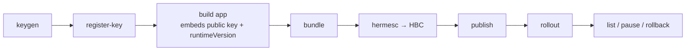

# CLI overview — `dash-ota`

`@dash-ota/cli` is the release tooling. It **holds the Ed25519 signing private key** (CI/release
env only): it bundles, encrypts, **signs**, publishes, and operates rollouts. The backend never
sees the private key, so a breached backend can't forge an update.

It ships as a single self-contained executable — run it with `npx`.

```bash
npx dash-ota <command> [flags]
# or: npm i -g @dash-ota/cli   →   dash-ota <command>
```

## Server / auth flags

Commands that talk to the backend accept:

| Flag | Env | Default | Meaning |
|---|---|---|---|
| `--server` | `OTA_SERVER` | `http://localhost:4455` | backend base URL |
| `--admin-token` | `OTA_ADMIN_TOKEN` | `dev-admin-token` | admin bearer (`/admin/*`) |

## The lifecycle



## Commands

`keygen` · `register-key` · `fingerprint` · `bundle` · `publish` · `list` · `rollout` · `pause` ·
`rollback` · `native-policy`. Full reference: [Commands →](/docs/cli/commands)

→ [Release workflow](/docs/cli/release-workflow) · [Per-environment keys](/docs/cli/environments-keys)
