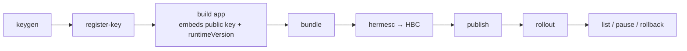

# CLI overview — `dash-ota`

`@dash-ota/cli` is the release tooling. It **holds the Ed25519 signing private key** (CI/release
env only): it bundles, encrypts, **signs**, publishes, and operates rollouts. The backend never
sees the private key, so a breached backend can't forge an update.

It ships as a single self-contained executable — run it with `npx`.

```bash
npx dash-ota <command> [flags]
# or: npm i -g @dash-ota/cli   →   dash-ota <command>
```

## Server / auth flags

Commands that talk to the backend accept:

| Flag | Env | Default | Meaning |
|---|---|---|---|
| `--server` | `OTA_SERVER` | `http://localhost:4455` | backend base URL |
| `--admin-token` | `OTA_ADMIN_TOKEN` | **none** | admin credential for `/admin/*` |
| `--allow-insecure` | — | off | permit plain `http://` to a remote host |

There is deliberately **no default admin token**. A command that talks to the backend without one
fails with `admin token required: pass --admin-token or set OTA_ADMIN_TOKEN (no default — the CLI
is the trust root)`. Plain `http://` to anything other than localhost is refused unless you pass
`--allow-insecure`.

## The lifecycle


```mermaid
flowchart LR
  keygen --> register-key --> build[build app<br/>embeds public key + runtimeVersion]
  build --> bundle --> hbc[hermesc → HBC] --> publish --> rollout
  rollout --> ops[list / pause / rollback]
```

## Commands

`keygen` · `register-key` · `fingerprint` · `bundle` · `publish` · `list` · `rollout` · `pause` ·
`rollback` · `native-policy` · `dashboard`. Full reference: [Commands →](/docs/cli/commands)

`npx dash-ota` with no arguments prints the same list with every flag.

## Prefer a UI?

[`dash-ota dashboard`](/docs/cli/dashboard) runs a local web console over the same operations —
a release table, rollout sliders, and a live publish log, bound to `127.0.0.1` and holding nothing.

→ [Release workflow](/docs/cli/release-workflow) · [Environments & flavours](/docs/react-native/environments)
