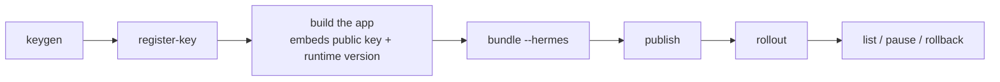

# CLI overview

`@dash-ota/cli` builds, signs and publishes releases, and manages them once they're out. It holds
your Ed25519 private key, so run it on your machine or in CI. The backend never sees the private
key, which is why a breached backend can't forge an update.

## Install

Add it to your app as a dev dependency and run it from the app root:

```bash
npm i -D @dash-ota/cli
npx dash-ota <command> [flags]
```

`npx dash-ota` runs the copy in your project's `node_modules`. There is no npm package called just
`dash-ota`, so in a folder without the CLI installed use `npx @dash-ota/cli <command>`, which
downloads the right package. The CLI needs Node 20.19 or later. It includes a native zstd module
(`@mongodb-js/zstd`); if your npm version asks you to approve install scripts, run
`npm install-scripts approve @mongodb-js/zstd`.

## Server and auth flags

Commands that talk to the backend accept:

| Flag | Env | Default | Meaning |
|---|---|---|---|
| `--server` | `OTA_SERVER` | `http://localhost:4455` | backend base URL |
| `--admin-token` | `OTA_ADMIN_TOKEN` | none | admin credential for `/admin/*` |
| `--allow-insecure` | — | off | allow plain `http://` to a host other than `localhost` |

There is no default admin token. A command that needs one fails with:

```
✗ admin token required: pass --admin-token or set OTA_ADMIN_TOKEN (no default — the CLI is the trust root).
```

Plain `http://` to anything other than `localhost` is refused unless you pass `--allow-insecure`.
Prefer the environment variables to the flags in shared shells and CI logs: a flag's value shows
up in process listings and shell history.

## The release lifecycle


```mermaid
flowchart LR
  keygen --> register-key --> build[build the app<br/>embeds public key + runtime version]
  build --> bundle[bundle --hermes] --> publish --> rollout
  rollout --> ops[list / pause / rollback]
```

## Commands

`keygen` · `register-key` · `fingerprint` · `bundle` · `publish` · `list` · `rollout` · `pause` ·
`rollback` · `native-policy` · `dashboard`

`npx dash-ota --help` lists them, and `npx dash-ota <command> --help` prints one command's flags,
which are required, and their defaults. The full reference is [Commands](/docs/cli/commands).

## Prefer a web page?

[`dash-ota dashboard`](/docs/cli/dashboard) serves a local page for the same operations: a
release table, rollout controls and a live publish log. It listens on `127.0.0.1` only and reads
its environments from a config file you keep next to your app.

→ [Release workflow](/docs/cli/release-workflow) · [Environments](/docs/react-native/environments)
