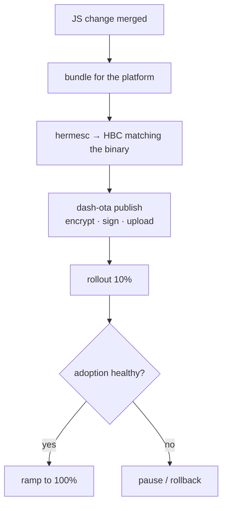

# Release workflow

The end-to-end path from a JS change to users running it.



## One-time per environment
```bash
dash-ota keygen --key-id key_prod_1                 # private key → CI secret
dash-ota register-key --key-id key_prod_1 --key-file .keys/key_prod_1.public.json
# embed publicKeyRawB64 + runtimeVersion in the prod build flavour, ship to the store
```

## Each JS release
```bash
# 1. bundle + HBC (the example's scripts/publish-ota.mjs does this in one step)
dash-ota bundle --project . --platform android --out ./out
# 2. publish to a small rollout
dash-ota publish --bundle-dir ./out --platform android --channel prod \
  --runtime-version auto --bundle-version 8 --rollout 10 --release-note "..."
# 3. watch, then ramp
dash-ota list
dash-ota rollout --bundle-id <id> --pct 100
```

## If something's wrong
```bash
dash-ota pause    --bundle-id <id>   # stop new installs immediately
dash-ota rollback --bundle-id <id>   # flag it; devices revert to last-known-good
```
The client-side crash-loop breaker and server-side auto-pause are your automatic safety nets;
these are the manual controls.

→ [Staged rollout guide](/docs/guides/staged-rollout) · [CI/CD](/docs/cli/ci-cd)
