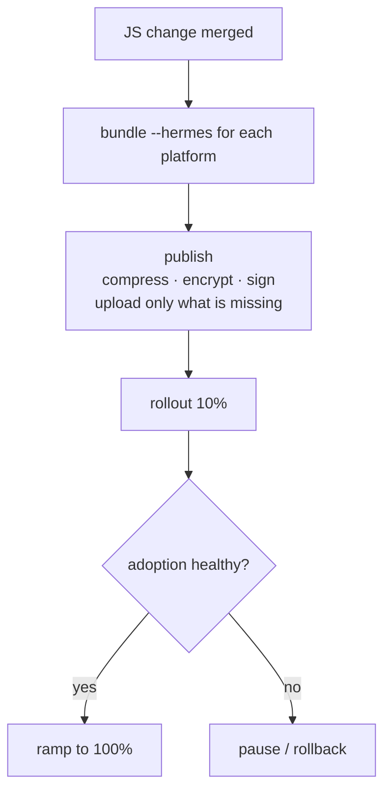

# Release workflow

From a merged JavaScript change to users running it. The commands run from your app's folder with
`@dash-ota/cli` installed as a dev dependency.


```mermaid
flowchart TB
  A[JS change merged] --> B[bundle --hermes for each platform]
  B --> D[publish<br/>compress · encrypt · sign<br/>upload only what is missing]
  D --> E[rollout 10%]
  E --> F{adoption healthy?}
  F -- yes --> G[ramp to 100%]
  F -- no --> H[pause / rollback]
```

## Once per environment

```bash
npx dash-ota keygen --key-id key_prod_1
npx dash-ota register-key --key-id key_prod_1 --key-file .keys/key_prod_1.public.json
```

Then put `publicKeyRawB64` and the runtime version into the prod build of your app and ship it to
the stores. See [Environments](/docs/react-native/environments).

`keygen` also writes `.keys/key_prod_1.content.key`. Keep it and use it for every release on this
channel: it's what lets the server store one copy of a file that several releases share.
`publish` stops if it's missing rather than making a new one, because a new key per release would
re-upload every file every time.

## Each release

```bash
# 1. Build the bundle. Keep --out the same every time.
npx dash-ota bundle --project . --platform android --out ./ota-out/android --hermes

# 2. Publish to a small share of devices.
npx dash-ota publish --bundle-dir ./ota-out/android --app-id com.example.app \
  --platform android --channel prod --key-id key_prod_1 \
  --runtime-version rt1 --bundle-version 8 --rollout 10 --release-note "Fix order screen crash"

# 3. Watch adoption, then ramp.
npx dash-ota list
npx dash-ota rollout --bundle-id <BUNDLE_ID> --pct 100
```

`<BUNDLE_ID>` is the `bundleId` that `publish` printed, also shown by `list`. Repeat steps 1 and 2
with `--platform ios` and `--out ./ota-out/ios` for iOS. `--key-id` matters: it defaults to
`key_dev_1`, which is the wrong key for prod.

## If something is wrong

```bash
npx dash-ota pause    --bundle-id <BUNDLE_ID>   # stop offering it; reversible with --resume
npx dash-ota rollback --bundle-id <BUNDLE_ID>   # stop offering it for good
```

Both stop the release reaching more devices. Neither changes devices that already installed it:
they keep running it until they get a newer release or the crash-loop breaker reverts it. To fix
those devices, publish a corrected release with a higher `--bundle-version`.

The automatic safety nets are the crash-loop breaker on each device and auto-pause on the server,
which stops offering a release once enough devices report it failing.

→ [Staged rollouts](/docs/guides/staged-rollout) · [CI/CD](/docs/cli/ci-cd) · [Rollback](/docs/guides/rollback)
