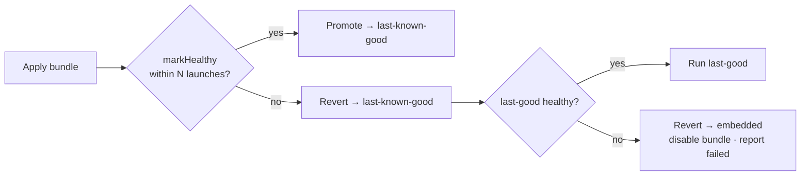

# Crash-loop circuit breaker

A bad OTA must never brick the app. dash-ota's breaker guarantees the app always boots to
*something* that runs.

## How it works

1. When a freshly-applied bundle boots, native bumps a **launch-attempt counter** for it.
2. Your app calls **`markHealthy()`** once it's genuinely usable (see [timing](#timing-matters)).
   That clears the counter and promotes the bundle to **last-known-good**.
3. If the app **crashes (or never calls `markHealthy()`) for N launches**, on the next launch
   native **reverts to last-known-good**.
4. If last-known-good *also* loops, native falls back to the **embedded** bundle (the one shipped
   in the binary — guaranteed to match the native code).
5. The bad bundle is added to a **`disabledBundles`** list so the client won't re-download it,
   and the failure is **reported to the backend** on the next reachable launch — which can
   **auto-pause** the rollout for everyone else.

## Timing matters

`markHealthy()` should be called **only after the app is genuinely usable** — e.g. once your
first real screen mounts *after* the auth gate — **not** merely when the JS bundle finishes
loading. A bundle that white-screens after load must still count as **unhealthy**.

- Default (safest): call `markHealthy()` yourself from your first real screen.
- Convenience: set `autoMarkHealthyMs` in config to auto-promote after a delay (use a value that's
  comfortably after your app becomes interactive).

→ [markHealthy & crash-loop in the client](/docs/react-native/mark-healthy) ·
[Server-side auto-pause](/docs/guides/staged-rollout)
