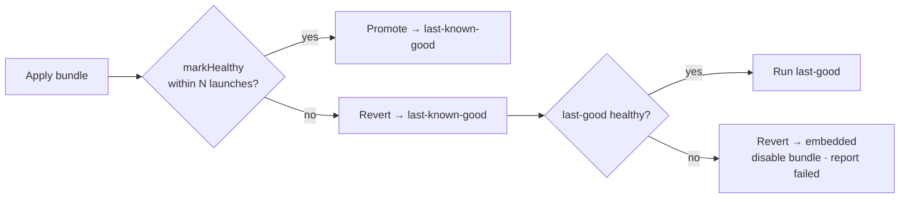

# Crash-loop circuit breaker

A bad OTA must never brick the app. dash-ota's breaker guarantees the app always boots to
*something* that runs.

## How it works

1. When a freshly-applied bundle boots, native bumps a **launch-attempt counter** for it.
2. Your app calls **`markHealthy()`** once it's genuinely usable (see [timing](#timing-matters)).
   That clears the counter and promotes the bundle to **last-known-good**.
3. If the app **crashes (or never calls `markHealthy()`) for N launches**, on the next launch
   native **reverts to last-known-good**.
4. If last-known-good *also* loops, native falls back to the **embedded** bundle (the one shipped
   in the binary — guaranteed to match the native code).
5. The bad bundle is added to a **`disabledBundles`** list so the client won't re-download it,
   and the failure is **reported to the backend** on the next reachable launch — which can
   **auto-pause** the rollout for everyone else.

```mermaid
flowchart LR
    A[Apply bundle] --> B{markHealthy<br/>within N launches?}
    B -- yes --> C[Promote → last-known-good]
    B -- no --> D[Revert → last-known-good]
    D --> E{last-good healthy?}
    E -- yes --> F[Run last-good]
    E -- no --> G[Revert → embedded<br/>disable bundle · report failed]
```

## Timing matters

`markHealthy()` should be called **only after the app is genuinely usable** — e.g. once your
first real screen mounts *after* the auth gate — **not** merely when the JS bundle finishes
loading. A bundle that white-screens after load must still count as **unhealthy**.

- Default (safest): call `markHealthy()` yourself from your first real screen.
- Convenience: set `autoMarkHealthyMs` in config to auto-promote after a delay (use a value that's
  comfortably after your app becomes interactive).

→ [markHealthy & crash-loop in the client](/docs/react-native/mark-healthy) ·
[Server-side auto-pause](/docs/guides/staged-rollout)

## What counts as a boot attempt (0.3.2+)

The bundle resolver runs **once per process**. React Native reads the host's `getJSBundleFile()` /
`bundleURL()` five or six times per launch; before 0.3.2 each read ran the resolver and spent an
attempt, so the breaker fired on the **first** boot of every bundle and disabled it.

An attempt is spent when a trial bundle is selected at launch. It is **refunded** at the next launch
if the previous process both:

1. reached JS — the TurboModule initialised, which dash-ota records as the *beacon*; and
2. was then paused — `Activity.onPause` on Android, `willResignActive` on iOS.

Coming back to the foreground **clears** the pause mark, so only a pause the app never returned from
counts as the user leaving. A bundle that pauses, resumes and then crashes is not forgiven, and the
transient resign-active iOS raises for a notification banner or an incoming call is discarded.

A crash cannot produce the pair, because the pause callback never runs. So a crash before JS and a
crash after JS both still count, while a user swiping the app away does not. Two real crashes
disable a bundle; force-killing the app any number of times does not.

Pause is used rather than background because an iOS swipe-kill from the app switcher only guarantees
resign-active.

**Known limit.** A bundle that is backgrounded and then crashes *while in the background*, before it
was ever marked healthy, is forgiven. Keeping `autoMarkHealthyMs` short (or calling `markHealthy()`
from your first real screen) closes that window, because a healthy bundle leaves the trial state
entirely and stops counting attempts.
