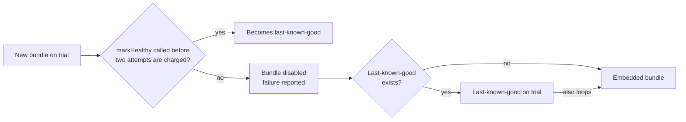

# Crash-loop circuit breaker

An update that crashes on launch must not leave the app unusable. The crash-loop breaker is the part
of dash-ota that notices a new bundle crashing and puts back the last one that worked. It runs in
native code, before your JavaScript starts.

## How it works

1. A new bundle is applied on the next cold start "on trial". That launch is attempt 1.
2. Each later cold start is charged another attempt, unless the previous process reached JavaScript
   and then went to the background. That pattern is the user leaving or closing the app, not a
   crash, so the attempt is refunded. A restart from `applyUpdate(true)` is not charged either.
3. When your app calls `markHealthy()`, the trial ends and the bundle becomes last-known-good. See
   [timing](#timing-matters).
4. If two attempts are charged without the trial ending, the next launch disables the bundle on this
   device and reverts to the last-known-good bundle, or to the embedded bundle (the one inside the
   binary) when there is no last-known-good.
5. In 0.5.1 and later, the last-known-good bundle then runs on trial too, with only the embedded
   bundle behind it, so if it also crash-loops the device ends up on the embedded bundle. Before
   0.5.1, the reverted-to bundle ran without the breaker watching it.
6. A disabled bundle is added to a list on the device and never downloaded again there. The failure
   is reported to the backend at the next check, which can
   [pause the release](/docs/guides/staged-rollout) for everyone else.


```mermaid
flowchart LR
    A[New bundle on trial] --> B{markHealthy called before<br/>two attempts are charged?}
    B -->|yes| C[Becomes last-known-good]
    B -->|no| D[Bundle disabled<br/>failure reported]
    D --> E{Last-known-good<br/>exists?}
    E -->|yes| F[Last-known-good on trial]
    E -->|no| G[Embedded bundle]
    F -->|also loops| G
```

The native log shows each step:

```
launch: applying pending bnd_rt1_3_mumksul0 on trial (attempt 1/2)
launch: bnd_rt1_3_mumksul0 on trial, attempt 2/2
launch: crash loop: disabling bnd_rt1_3_mumksul0, reverting to bnd_rt1_2_mumkmbz7 on trial
[dash-ota] reporting crash-loop failure of bnd_rt1_3_mumksul0
[dash-ota] skipping disabled bundle bnd_rt1_3_mumksul0
```

## Timing matters

Call `markHealthy()` once the app is actually usable, for example when the first real screen after
sign-in has rendered, not as soon as JavaScript has loaded. A bundle that loads and then shows a
blank screen should not end its trial.

- Recommended: call `markHealthy()` yourself from your first real screen.
- Simpler: set `autoMarkHealthyMs` in the config, and the provider calls it after that delay. Pick a
  delay well after your app becomes usable.

If you never call it, a bundle that works is still not reverted, because normal sessions are
refunded. It never becomes last-known-good, though, and the backend never gets a `healthy` report
for it. See [markHealthy](/docs/react-native/mark-healthy).

→ [markHealthy in the client](/docs/react-native/mark-healthy) ·
[Server-side auto-pause](/docs/guides/staged-rollout)

## What counts as an attempt

The bundle loader works out which bundle to load once per process. React Native reads the bundle
path five or six times per launch, and before 0.4.0 each read spent an attempt, so the breaker fired
on the first launch of every update and disabled it.

An attempt is refunded at the next launch if the previous process both:

1. reached JavaScript: the native module was initialised, which dash-ota records as a marker; and
2. was then paused: `Activity.onPause` on Android, `willResignActive` on iOS.

Coming back to the foreground clears the pause marker, so only a pause the app never returned from
counts as the user leaving. A bundle that pauses, resumes and then crashes is not refunded. The brief
resign-active that iOS sends for a notification banner or an incoming call is cleared the same way.

A crash never produces both markers, because the pause callback does not run. So a crash before
JavaScript starts and a crash after it both count, while a user swiping the app away does not. Two
counted crashes disable a bundle; closing the app any number of times does not.

Pause is used rather than "entered background" because swiping an app away in the iOS app switcher
only guarantees the resign-active callback.

One known gap: a bundle that goes to the background and then crashes while in the background, before
it was marked healthy, is refunded. Calling `markHealthy()` from your first real screen, or a short
`autoMarkHealthyMs`, closes that gap, because a healthy bundle is no longer on trial.
