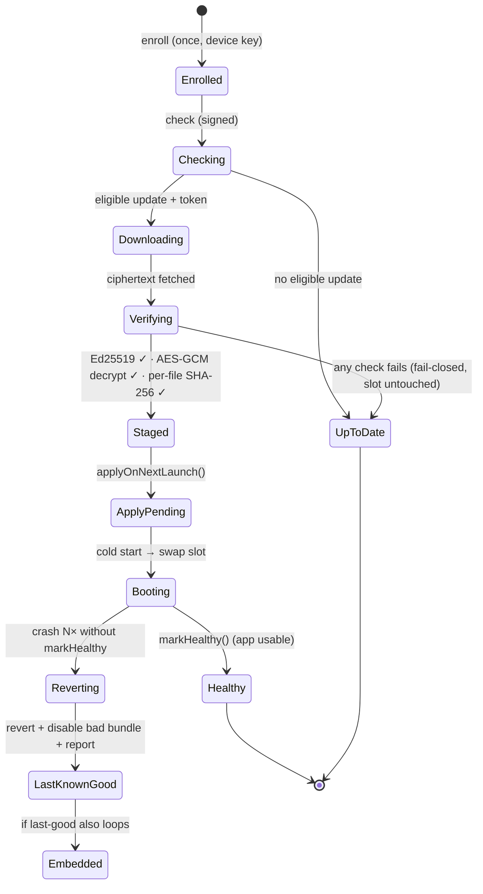

# The OTA lifecycle

Every update flows through the same fail-closed state machine. The **trust-critical** steps
(verify, decrypt, hash, stage, apply, rollback) run in **native**; JS only orchestrates.

## Step by step

1. **Enroll (once).** On first launch the app generates a hardware device key and registers its
   **public** half with the backend, gated by your app session token. No secret is transmitted.
2. **Check.** A device-key-signed `POST /ota/v1/check` reports the device's `runtimeVersion`,
   `channel`, `appVersion`, build number, and current `bundleVersion`. The backend applies
   [targeting + rollout](/docs/concepts/versioning-targeting) and returns either *"no update"* or a
   **pre-signed manifest** + a one-time download token.
3. **Download.** `GET /ota/v1/download` with the token streams the **AES-GCM ciphertext** — there
   is **no S3 URL** on the client.
4. **Verify (native).** The native side:
   - verifies the **Ed25519 signature** over the canonical manifest bytes against the **embedded
     public key**,
   - confirms the manifest's `runtimeVersion` equals the binary's and `bundleVersion > current`,
   - **AES-256-GCM decrypts** the payload (the GCM tag authenticates the bytes),
   - unpacks the archive and verifies **every file's SHA-256 and size**.
   Any failure deletes staged files and aborts — the running bundle is untouched.
5. **Stage.** The verified bundle is written to a slot atomically (temp → fsync → rename) and
   marked `pending`.
6. **Apply.** On the **next cold start**, native swaps to the pending slot and bumps a
   launch-attempt counter. (dash-ota never hot-swaps mid-session.)
7. **Confirm.** Once your app is genuinely usable, call `markHealthy()`. That promotes the bundle
   to last-known-good, clears the counter, and reports `healthy` to the backend (driving adoption).
8. **Rollback (if needed).** If the app crashes N times before `markHealthy()`, the
   [crash-loop breaker](/docs/concepts/crash-loop) reverts to last-known-good — then the embedded
   bundle — disables the bad bundle, and reports the failure (which can auto-pause the rollout).

## Update modes

- **Auto** (default): silent check → download → verify → apply on next cold start.
- **Manual**: your UI calls `checkNow()` / `applyUpdate()`.
- **Mandatory**: a release flagged `mandatory` shows a blocking "reopen the app" prompt.

→ [Update modes in detail](/docs/react-native/update-modes) · [Native vs JS trust split](/docs/concepts/native-vs-js)
