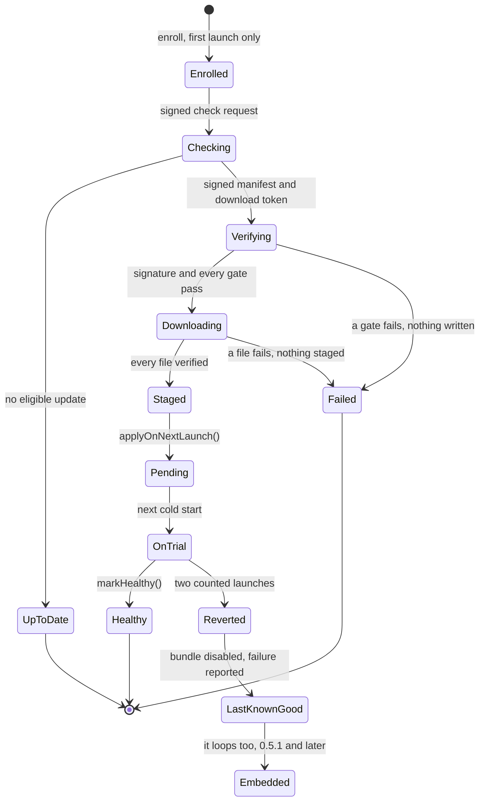

# The OTA lifecycle

Every update goes through the same steps. The steps that decide whether a bundle is trusted (verify,
decrypt, hash, stage, apply, revert) run in native code; JavaScript only starts them and reports the
results. When any step fails, the app keeps running the bundle it already had.

```mermaid
stateDiagram-v2
    [*] --> Enrolled: enroll, first launch only
    Enrolled --> Checking: signed check request
    Checking --> UpToDate: no eligible update
    Checking --> Verifying: signed manifest and download token
    Verifying --> Downloading: signature and every gate pass
    Verifying --> Failed: a gate fails, nothing written
    Downloading --> Staged: every file verified
    Downloading --> Failed: a file fails, nothing staged
    Staged --> Pending: applyOnNextLaunch()
    Pending --> OnTrial: next cold start
    OnTrial --> Healthy: markHealthy()
    OnTrial --> Reverted: two counted launches
    Reverted --> LastKnownGood: bundle disabled, failure reported
    LastKnownGood --> Embedded: it loops too, 0.5.1 and later
    Healthy --> [*]
    UpToDate --> [*]
    Failed --> [*]
```

A cold start is the app process starting from nothing, rather than coming back from the background.
The embedded bundle is the JavaScript packaged inside the app binary.

## Step by step

1. **Enroll (first launch).** The app creates a device key: in the Android Keystore, or in the iOS
   Secure Enclave (falling back to a software key in the keychain if the Secure Enclave cannot create
   one, unless `OTA_REQUIRE_HARDWARE_KEY` is set). It sends the public half to `/ota/v2/enroll`,
   together with the token from `getEnrollToken`. Your backend's `verifyEnrollToken` hook decides
   whether to accept it; without the hook the backend only checks that a token is present. Nothing
   secret is sent, and later launches skip this step.
2. **Check.** The app sends `POST /ota/v2/check`, signed with the device key, with its runtime
   version, channel, platform, app version, native build number, and the version, id and hash of the
   bundle it is running. The backend applies [targeting and rollout](/docs/concepts/versioning-targeting)
   and answers either "no update" or the release's signed manifest plus a download token for that
   release (valid for 30 minutes by default). The response also carries the
   [force-update policy](/docs/concepts/force-update) and a server nonce for reports; neither is
   covered by the signature.
3. **Verify the manifest.** Before downloading anything, native code checks, in order: the Ed25519
   signature against every public key compiled into the binary; that the manifest is schema 2; that
   `appId` is this app; that `runtimeVersion` matches the binary; that `channel`, `platform` and
   `minNativeBuild` fit this binary (0.5.1 and later); that `bundleVersion` is higher than the
   running bundle's; that this device has not disabled the bundle; that the bundle id and file hashes
   are safe to use as file names (0.5.1 and later); and that every file path is safe (no `..`, no
   absolute path, no backslash or NUL, at most 512 bytes). Nothing is written until the signature
   verifies, and nothing is downloaded until every check passes. A valid signature over a path such
   as `../../x` is still refused.
4. **Download only what is missing.** If the device already has a file with the same SHA-256 in its
   current or last-known-good bundle, it reuses that file and hashes it again. Otherwise it fetches
   `GET /ota/v2/releases/:bundleId/blobs/:sha256` from your backend, with the download token in the
   `x-ota-download-token` header. On Android an interrupted file resumes with an HTTP `Range` request;
   on iOS each file is downloaded whole in one HTTP 200 response and held in memory. Each file's
   SHA-256 is checked before it is decrypted, AES-256-GCM decryption fails if any byte was changed,
   decompression stops at the size the signed manifest declares, and the result's size and SHA-256
   are checked again. Any failure ends the attempt with nothing staged.
5. **Stage.** Files go into a staging folder that survives the process being killed mid-download.
   When every file has passed, the folder is renamed into place and recorded as staged.
   The move is refused if any file the manifest lists is missing, so a half-filled bundle never
   runs. The provider logs `[dash-ota] staged <bundleId> v<bundleVersion>` and marks the bundle to
   apply on the next launch.
6. **Apply.** On the next cold start, the bundle loader switches to the new bundle and starts its
   trial, logging `launch: applying pending <bundleId> on trial (attempt 1/2)`. dash-ota never swaps
   the bundle under running JavaScript; `applyUpdate(true)` restarts the app to apply at once.
7. **Confirm.** The check on that launch reports `applied` to the backend. When your app calls
   `markHealthy()`, the trial ends, the bundle becomes last-known-good, and `healthy` is reported
   after the next check.
8. **Revert if it keeps failing.** If the bundle's trial is charged two launches (a launch is not
   charged when the previous one reached JavaScript and then went to the background), the next
   launch disables it on this device and goes back to the last-known-good bundle, or to the embedded
   one if there is none. The failure is reported at the next check and can pause the release on the
   server. See the [crash-loop breaker](/docs/concepts/crash-loop).

## Withdrawing a release

`dash-ota rollback --bundle-id <id>` marks a release as rolled back and paused on the server. No
device is offered it again, and downloads already in progress get HTTP 410. The server cannot make a
device roll back: devices that already applied the release keep running it until they get a newer
release, the crash-loop breaker reverts it, or your app calls `rollback()`. Relaunching does not
revert it. See [Rollback](/docs/guides/rollback).

## Update modes

- Automatic (the default): check on launch, download, verify, and apply on the next cold start.
- Manual: with `autoStage: false`, your UI decides when to call `downloadUpdate()` and
  `applyUpdate()`.
- Mandatory: a release published with `--mandatory` sets `ui.blocking`. The library shows nothing
  itself; your app decides what a blocking prompt looks like.

→ [Update modes in detail](/docs/react-native/update-modes) · [Native vs JS trust split](/docs/concepts/native-vs-js)
