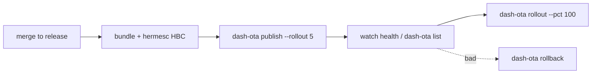

# CI/CD release pipeline

A complete, auditable pipeline: build → sign → publish → ramp, with the signing key in a secret.

## Stages



## Minimal GitHub Actions

See the full workflow in [CLI → CI/CD](/docs/cli/ci-cd). The essentials:

```yaml
- run: npm ci
- run: echo "${{ secrets.OTA_SIGNING_KEY_PROD }}" > .keys/key_prod.private.pem
- run: node scripts/publish-bundle.mjs --platform android --out ./out   # bundle + HBC
- env:
    OTA_SERVER: ${{ secrets.OTA_SERVER }}
    OTA_ADMIN_TOKEN: ${{ secrets.OTA_ADMIN_TOKEN }}
  run: npx dash-ota publish --bundle-dir ./out --platform android --channel prod
       --runtime-version auto --bundle-version ${{ github.run_number }} --rollout 5 --key-id key_prod
```

## Good practices
- **Both platforms:** run a matrix over `--platform android|ios`, each with its own bundle + HBC.
- **runtimeVersion:** `auto` (fingerprint) so an OTA can't land on an incompatible binary.
- **Gated ramp:** a separate, manually-approved job runs `dash-ota rollout --pct 100`.
- **Source maps:** upload the Hermes-composed map per OTA to your crash reporter (see [Hermes](/docs/cli/hermes)).
- **Secrets:** private signing key + admin token live in CI secrets / KMS; never in the repo.
