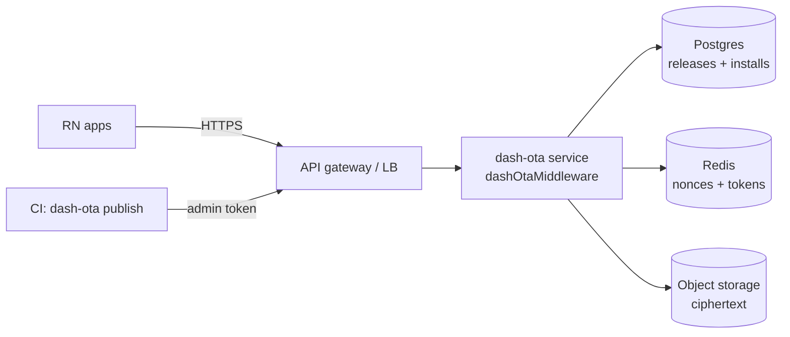

# Self-host the backend

The POC backend persists to disk (JSON + files). For production, run it behind your gateway with a
real store. The route core is unchanged — you swap the `Store` implementation.

## Production topology

## Mapping the store

| POC (default disk) | Production |
|---|---|
| `releases.json` / `installs.json` | Postgres tables |
| `storage/*.bin` ciphertext | S3 / GCS / R2 (stream through `/download`) |
| in-memory nonce/token caches | Redis with TTLs |

Implement the [custom store](/docs/backend/store) surface (`addRelease`, `pickEligible`,
`enroll`, `getDevicePublicKey`, nonce/token issue/consume, `recordConfirm`, native policy) and pass
it via `createOtaBackend({ store })`.

## Checklist
- ✅ HTTPS at the gateway; restrict `/admin/*` at the network layer.
- ✅ Strong `adminToken`; implement `verifyEnrollToken` against your IdP.
- ✅ Redis for anti-replay across instances.
- ✅ Object storage for ciphertext (the client still never sees an S3 URL — you stream it).
- ✅ Alert on auto-pause and failure spikes via `onConfirm`.

See [Deployment](/docs/backend/deployment) and [Production hardening](/docs/backend/hardening).
