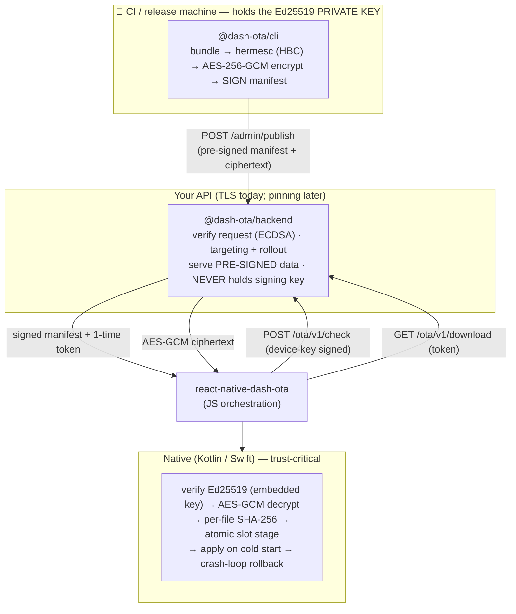

# Architecture

dash-ota is built around one idea: **divide trust** so that a compromise of any single component
— the backend, the network, or even the running JS bundle — cannot forge or apply a malicious
update.

## The pieces

## Division of trust

- **Networking + orchestration run in JS.** Easy to iterate; TLS pinning plugs in here later.
  But JS is treated as **untrusted** for security decisions.
- **Trust-critical steps run in native** — signature verify, decrypt, per-file hash, file swap,
  rollback — *before* and *independent of* JS. A compromised bundle cannot disable its own
  verification.
- **Signing happens only in the CLI/CI.** The backend stores and serves pre-signed data.

The result: a compromised backend, a broken TLS channel, or a tampered JS bundle each
**independently fail** to forge or apply an update.

## Where the keys live

| Key | Lives in | Purpose |
|---|---|---|
| Ed25519 **private** signing key | CLI / CI secret (KMS/HSM) | sign manifests — never on the backend or device |
| Ed25519 **public** key(s) | embedded in the app binary (per flavour) | native signature verification |
| Device key (EC P-256, **private**) | AndroidKeyStore / Secure Enclave on each device | sign requests; never leaves the device |
| Device key (public) | registered on the backend at enroll | verify the device's requests |
| AES-256-GCM content key | inside the **signed** manifest | decrypt the payload natively |

## Data flow, end to end

1. **Build & sign (CLI/CI):** bundle JS → compile Hermes HBC → AES-256-GCM encrypt → build a
   manifest of per-file SHA-256 hashes → **Ed25519-sign** it → upload to the backend.
2. **Enroll (client, once):** the app generates a hardware device key and registers its **public**
   half (gated by your app session token).
3. **Check (client):** a device-key-signed request asks for an eligible update; the backend
   applies targeting/rollout and returns the **pre-signed** manifest + a one-time download token.
4. **Download + verify (native):** fetch the ciphertext, **verify the Ed25519 signature against
   the embedded key**, AES-GCM decrypt, verify every file's hash, stage atomically.
5. **Apply (native):** swap to the new slot on next cold start; bump a launch counter.
6. **Confirm (client):** after the app is usable, `markHealthy()` promotes the bundle and reports
   adoption; a crash before that triggers the rollback breaker.

Read the [full lifecycle](/docs/concepts/lifecycle) for the state machine, and
[native vs JS](/docs/concepts/native-vs-js) for the trust split in detail.
