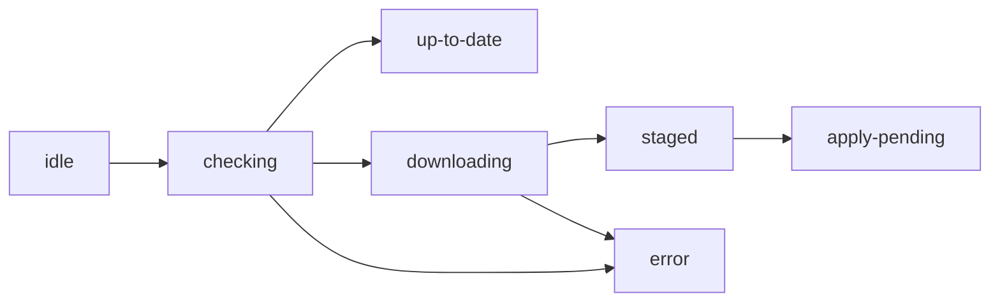

# `useOtaUpdate()`

The single hook for reading OTA state and driving actions. Must be used within
[`<DashOtaProvider>`](/docs/react-native/provider-config).

```tsx
import { useOtaUpdate } from 'react-native-dash-ota';

function UpdateControls() {
  const ota = useOtaUpdate();
  return (
    <>
      <Text>status: {ota.status}</Text>
      <Button title="Check now" onPress={ota.checkNow} />
      {ota.availableUpdate && (
        <Button title="Apply & restart" onPress={() => ota.applyUpdate(true)} />
      )}
      <Button title="Roll back" onPress={ota.rollback} />
    </>
  );
}
```

## Returned state

| Field | Type | Description |
|---|---|---|
| `status` | `OtaStatus` | `'idle' \| 'checking' \| 'downloading' \| 'staged' \| 'apply-pending' \| 'up-to-date' \| 'error'` |
| `channel` | `string` | the build flavour's channel (`dev`/`uat`/`prod`), from native |
| `currentBundle` | `BundleMeta \| null` | `{ bundleId, bundleVersion, runtimeVersion, isEmbedded }` |
| `availableUpdate` | `AvailableUpdate \| null` | `{ bundleId, bundleVersion, mandatory, releaseNotes }` when one was found |
| `isMandatory` | `boolean` | whether the available update is mandatory |
| `nativePolicy` | `NativeVersionPolicy \| null` | the [force-update gate](/docs/concepts/force-update) policy |
| `progress` | `number` | 0→1 staging progress |
| `error` | `string \| null` | last error message (fail-closed; the app keeps running) |

## Actions

| Action | Signature | What it does |
|---|---|---|
| `checkNow` | `() => Promise<void>` | Manually run a check (and auto-download/stage if `autoStage`). Single-flighted. |
| `applyUpdate` | `(restart?: boolean) => Promise<void>` | Schedule the staged update to apply on next cold start. Pass `true` for a **best-effort** in-process restart (see note). |
| `markHealthy` | `() => void` | Promote the running bundle to last-known-good. Call **once your app is genuinely usable**. |
| `rollback` | `() => Promise<void>` | Force a revert to the last-known-good bundle. |

:::note `restart()` is best-effort
Under the New Architecture / bridgeless runtime, programmatic reload is unreliable. The
**recommended** path is apply-on-next-cold-start (`applyUpdate()` with no argument). For
*mandatory* updates, prefer a blocking "please reopen the app" prompt over betting on
`applyUpdate(true)`.
:::

## Status transitions



Subscribe to transitions via `onStatusChange` in [config](/docs/react-native/provider-config), or
read `status` directly.

→ [Update modes](/docs/react-native/update-modes) · [markHealthy timing](/docs/react-native/mark-healthy)
