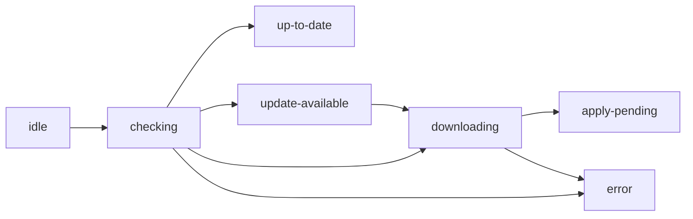

# `useOtaUpdate()`

The single hook for reading OTA state and driving actions. Must be used within
[`<DashOtaProvider>`](/docs/react-native/provider-config).

Read **`ota.ui`**. It is the whole announce → download → restart flow, already derived: which phase
the user is in, the copy for it, whether the button is live, and one `action()` that does the correct
next thing. Mapping raw statuses yourself is how hosts end up offering "Restart" mid-download.

```tsx
import { useOtaUpdate } from 'react-native-dash-ota';

function UpdateRow() {
  const { ui, markHealthy } = useOtaUpdate();
  useEffect(() => markHealthy(), []); // once the app is genuinely usable

  if (!ui.visible) return null;
  return (
    <View>
      <Text>{ui.title}</Text>
      <Text>{ui.description}</Text>
      {ui.busy && <ActivityIndicator />}
      {ui.cta && <Button title={ui.cta} disabled={!ui.ctaEnabled} onPress={ui.action} />}
    </View>
  );
}
```

## `ui` — the view model

| Field | Type | Description |
|---|---|---|
| `phase` | `OtaPhase` | `'none' \| 'available' \| 'working' \| 'ready' \| 'error'` |
| `visible` | `boolean` | `phase !== 'none'` |
| `title` / `description` | `string` | copy for the phase; override with [`uiCopy`](/docs/react-native/provider-config) |
| `cta` | `string \| null` | button label; `null` in a phase with no action (while downloading) |
| `ctaEnabled` | `boolean` | false while an action is in flight — the double-tap guard lives here |
| `busy` | `boolean` | an operation is running; show a spinner |
| `progress` | `number \| null` | 0–1 while downloading. `null` means indeterminate — **iOS always reports indeterminate**, because the native side does not emit progress there yet. Render a spinner for `null` and a bar otherwise. |
| `blocking` | `boolean` | the update is mandatory — do not let the user dismiss this UI |
| `action` | `() => Promise<void>` | download → restart → retry, whichever the phase calls for |

The phases map to what the user can do, not to internals: `available` waits for a download decision,
`working` is checking/downloading, `ready` has a verified bundle staged and needs a restart, `error`
offers a retry. `ready` is **sticky** for the life of the process, so a foreground re-check can't
downgrade "Restart now" back to "Download" while a bundle is sitting staged.

## Raw state

For diagnostics and non-standard flows.

| Field | Type | Description |
|---|---|---|
| `status` | `OtaStatus` | `'idle' \| 'checking' \| 'up-to-date' \| 'update-available' \| 'downloading' \| 'apply-pending' \| 'error' \| 'disabled'` |
| `channel` | `string` | the build flavour's channel (`dev`/`uat`/`prod`), from native |
| `currentBundle` | `BundleMeta \| null` | `{ bundleId, bundleVersion, runtimeVersion, isEmbedded }` |
| `availableUpdate` | `AvailableUpdate \| null` | `{ bundleId, bundleVersion, mandatory, releaseNotes }` when one was found |
| `isMandatory` | `boolean` | whether the available update is mandatory |
| `nativePolicy` | `NativeVersionPolicy \| null` | the [force-update gate](/docs/concepts/force-update) policy |
| `progress` | `number` | 0→1 staging progress |
| `error` | `string \| null` | last error message (fail-closed; the app keeps running) |

## Actions

`ui.action()` covers the standard flow. These stay exported for everything else.

| Action | Signature | What it does |
|---|---|---|
| `checkNow` | `() => Promise<void>` | Manually run a check (and auto-download/stage if `autoStage`). Single-flighted. |
| `downloadUpdate` | `() => Promise<boolean>` | Download + verify + stage what the last check announced. Re-checks once by itself if the one-time download token went stale. |
| `applyUpdate` | `(restart?: boolean) => Promise<boolean>` | Arm the staged update for the next launch. `true` also restarts now. Resolves `false` when nothing is staged — it will not restart on a promise it can't keep. |
| `markHealthy` | `() => void` | Promote the running bundle to last-known-good. Call **once your app is genuinely usable**. |
| `rollback` | `() => Promise<void>` | Force a revert to the last-known-good bundle. |

:::note[How `restart()` works]
Restarting under the New Architecture is platform-specific: iOS re-triggers the reload command (the
host re-resolves the bundle URL), Android relaunches the process, because `ReactHost.reload()` replays
the bundle loader captured at startup and would silently run the *old* bundle. Both paths are
verified on device; apply-on-next-cold-start (`applyUpdate()` with no argument) remains the most
conservative option.
:::

## Status transitions


```mermaid
flowchart LR
  idle --> checking
  checking --> up-to-date
  checking --> update-available
  update-available --> downloading
  checking --> downloading
  downloading --> apply-pending
  checking --> error
  downloading --> error
```

Subscribe to transitions via `onStatusChange` in [config](/docs/react-native/provider-config), or
read `status` directly.

→ [Update modes](/docs/react-native/update-modes) · [markHealthy timing](/docs/react-native/mark-healthy)
