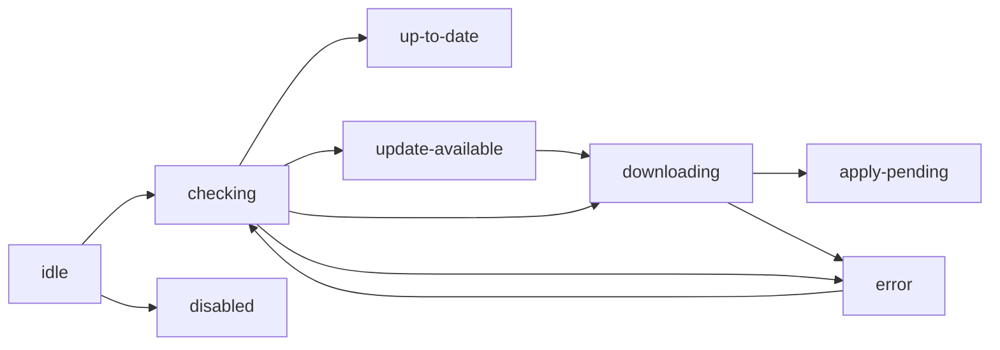

# `useOtaUpdate()`

The hook your components use to read OTA state and trigger actions. Call it from a component inside
[`<DashOtaProvider>`](/docs/react-native/provider-config); outside it, the hook throws.

For an update prompt, read `ui`. It already works out which phase the user is in, the text to show,
whether the button can be pressed, and an `action()` that does the right next step. If you build the
same thing from the raw `status` yourself, it is easy to offer "Restart" while a download is still
running, which throws the partial download away.

```tsx
import { ActivityIndicator, Button, Text, View } from 'react-native';
import { useOtaUpdate } from 'react-native-dash-ota';

export function UpdateRow() {
  const { ui } = useOtaUpdate();

  if (!ui.visible) return null;
  return (
    <View>
      <Text>{ui.title}</Text>
      <Text>{ui.description}</Text>
      {ui.busy ? <ActivityIndicator /> : null}
      {ui.cta ? <Button title={ui.cta} disabled={!ui.ctaEnabled} onPress={() => void ui.action()} /> : null}
    </View>
  );
}
```

Also call `markHealthy()` from your first usable screen; see
[markHealthy](/docs/react-native/mark-healthy).

## `ui`

| Field | Type | Description |
|---|---|---|
| `phase` | `OtaPhase` | `'none' \| 'available' \| 'working' \| 'ready' \| 'error'` |
| `visible` | `boolean` | `true` when `phase` is not `'none'`. |
| `title`, `description` | `string` | Text for the phase. Change it with [`uiCopy`](/docs/react-native/provider-config#uicopy). |
| `cta` | `string \| null` | Button label, or `null` when the phase has no action (while downloading). |
| `ctaEnabled` | `boolean` | `false` while an action is running or when there is no action. This is the double-tap guard. |
| `busy` | `boolean` | A check, download or action is running. Show a spinner. |
| `progress` | `number \| null` | Download progress from 0 to 1, or `null` when it is not known. Only Android sends progress events, so on iOS it stays `null` for the whole download. Show a spinner for `null` and a bar otherwise. |
| `blocking` | `boolean` | The update is mandatory: don't let the user dismiss or postpone the prompt. See [Update modes](/docs/react-native/update-modes#mandatory) for when it clears. |
| `action` | `() => Promise<void>` | Does the next step for the phase: downloads in `available`, restarts in `ready`, checks again in `error`. |

What each phase means:

- `none`: nothing to show. The provider is idle, checking, up to date, or disabled.
- `available`: a check found an update and is waiting for you to start the download. In practice you
  see this with `autoStage: false`, or for a mandatory release with `mandatory: 'announce'`.
- `working`: the update is downloading. A check on its own does not show as `working`.
- `ready`: the update is verified and staged, and the app has to restart to run it. This phase stays
  for the life of the process, so a later check cannot turn "Restart now" back into "Download".
- `error`: the last check or download failed. The action runs a new check.

## Raw state

For diagnostics and for flows `ui` doesn't cover.

| Field | Type | Description |
|---|---|---|
| `status` | `OtaStatus` | `'idle' \| 'checking' \| 'up-to-date' \| 'update-available' \| 'downloading' \| 'apply-pending' \| 'error' \| 'disabled'` |
| `channel` | `string` | The channel compiled into the binary: `dev`, `uat` or `prod`. |
| `currentBundle` | `BundleMeta \| null` | The running bundle: `{ bundleId, bundleVersion, runtimeVersion, isEmbedded, bundleSha256 }`. `isEmbedded` is `true` for the bundle shipped inside the app, whose `bundleVersion` is `0`. |
| `availableUpdate` | `AvailableUpdate \| null` | `{ bundleId, bundleVersion, mandatory, releaseNotes }` for the update the last check offered. |
| `isMandatory` | `boolean` | The offered update is mandatory. In 0.5.1 and later it goes back to `false` if the download or verification fails, unless a verified mandatory update is already staged. |
| `nativePolicy` | `NativeVersionPolicy \| null` | The [force-update](/docs/concepts/force-update) policy from the last successful check. |
| `progress` | `number` | Download progress from 0 to 1. On iOS it jumps from 0 to 1. |
| `error` | `string \| null` | The last error message. The app keeps running its current bundle. |

## Actions

`ui.action()` covers the usual flow. These are there for everything else.

| Action | Signature | What it does |
|---|---|---|
| `checkNow` | `() => Promise<void>` | Runs a check. With `autoStage` on, it also downloads and stages what it finds; with `autoStage: false` it stops at `update-available`. Ignored while another check is running. |
| `downloadUpdate` | `() => Promise<boolean>` | Downloads, verifies and stages the update the last check offered. Resolves `false` if there is nothing to download. If the server refuses the download (for example because the download token, valid for 30 minutes by default, has expired), it runs one new check and tries again. |
| `applyUpdate` | `(restart?: boolean) => Promise<boolean>` | Sets the staged update to load on the next cold start. With `true` it also restarts the app now. Resolves `false`, and does not restart, when nothing is staged yet, for example while the download is still running. |
| `markHealthy` | `() => void` | Marks the running bundle as working and makes it the last-known-good bundle. Call it once your app is usable. See [markHealthy](/docs/react-native/mark-healthy). |
| `rollback` | `() => Promise<void>` | Switches back to the last-known-good bundle (or the embedded one) and reports `rolled_back` to the backend. The switch takes effect on the next cold start. It does not block the release: if the server still offers it, a later check downloads it again. |

A cold start means the app process starts from nothing, as opposed to coming back from the
background.

:::note[What `applyUpdate(true)` does on each platform]
On Android, the app relaunches in a new process. Android's in-process reload reuses the bundle
loader created at startup and would keep running the old bundle, so it is not used. The log shows
`restart: relaunching for OTA apply` followed by `restart: exiting process`.

On iOS, React Native reloads in the same process and asks for the bundle URL again. In 0.5.1 and
later that loads the new bundle; before 0.5.1 the reload ran the old bundle, and the update only
appeared after the next cold start.

On both platforms, a restart you trigger this way is not counted as a crash by the
[crash-loop breaker](/docs/concepts/crash-loop). `applyUpdate()` without an argument waits for the
next cold start instead.
:::

`downloadUpdate()` retrying after an expired token also works on iOS from 0.5.1. Before 0.5.1, iOS
errors did not include the HTTP status, so the retry never triggered there.

## Status transitions


```mermaid
flowchart LR
  idle --> checking
  idle --> disabled
  checking --> up-to-date
  checking --> update-available
  checking --> downloading
  update-available --> downloading
  downloading --> apply-pending
  checking --> error
  downloading --> error
  error --> checking
```

`update-available` only appears with `autoStage: false` (or for a mandatory release with
`mandatory: 'announce'`). To follow transitions, pass `onStatusChange` in the
[config](/docs/react-native/provider-config), or read `status`.

→ [Update modes](/docs/react-native/update-modes) · [markHealthy](/docs/react-native/mark-healthy)
